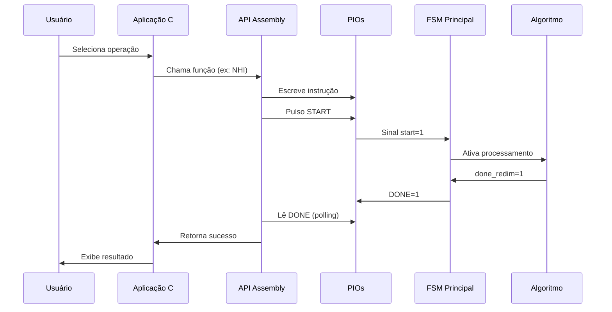

# Coprocessador de Imagens com Interface HPS–FPGA

[](https://www.terasic.com.tw/cgi-bin/page/archive.pl?Language=English&No=836)
[](https://www.intel.com/content/www/us/en/software/programmable/quartus-prime/overview.html)
[](https://developer.arm.com/ip-products/processors/cortex-a/cortex-a9)
[](LICENSE)

**Problema 2 – Sistemas Digitais (TEC499) 2025.2**  
**Universidade Estadual de Feira de Santana (UEFS)**

---

## 📋 Índice

- [Sobre o Projeto](#-sobre-o-projeto)
- [Declaração do Problema](#-declaração-do-problema)
- [Requisitos do Sistema](#-requisitos-do-sistema)
- [Arquitetura da Solução](#-arquitetura-da-solução)
- [Manual do Sistema](#-manual-do-sistema)
  - [Modificações no Hardware (FPGA)](#modificações-no-hardware-fpga)
  - [Integração HPS–FPGA](#integração-hpsfpga)
  - [Sistema HPS (Software)](#sistema-hps-software)
- [Manual do Usuário](#-manual-do-usuário)
- [Testes e Validação](#-testes-e-validação)
- [Resultados Alcançados](#-resultados-alcançados)
- [Ambiente de Desenvolvimento](#-ambiente-de-desenvolvimento)
- [Referências](#-referências)
- [Equipe](#-equipe)

---

## 🎯 Sobre o Projeto

Este projeto foi desenvolvido como parte do **Problema 2** da disciplina **Sistemas Digitais (TEC499)** da **Universidade Estadual de Feira de Santana (UEFS)**. O objetivo central é compreender e aplicar os conceitos de **programação em Assembly e integração software–hardware**, por meio da **implementação de uma biblioteca de controle (API)** e de uma **aplicação em linguagem C** destinada ao gerenciamento de um **coprocessador gráfico** na plataforma **DE1-SoC**.

### 🎓 Objetivos de Aprendizagem

O projeto visa desenvolver as seguintes competências:

- ✅ Aplicar conhecimentos de circuitos digitais e arquiteturas de computadores
- ✅ Implementar drivers de software e APIs em Assembly
- ✅ Compreender a interface hardware-software
- ✅ Utilizar mapeamento de memória em arquitetura ARM
- ✅ Programar em Assembly ARM e linguagem C
- ✅ Integrar HPS (Hard Processor System) com FPGA
- ✅ Realizar link-edição entre módulos Assembly e C
- ✅ Desenvolver sistemas embarcados para processamento de imagens

###  Entregas do Projeto

**Etapa 2 (Concluída):**
- ✅ API em Assembly para controle do coprocessador
- ✅ ISA (Instruction Set Architecture) implementada
- ✅ Comunicação HPS–FPGA via PIOs
- ✅ Sistema de escrita de pixels na VRAM

**Etapa 3 (Em Desenvolvimento):**
- 🔄 Aplicação em C para interface de usuário
- 🔄 Carregamento de imagens BITMAP
- 🔄 Controle de zoom in/out via teclado

---

##  Declaração do Problema

### Contexto

Você faz parte de uma equipe contratada para projetar um **módulo embarcado de redimensionamento de imagens** para sistemas de vigilância e exibição em tempo real. O hardware deverá aplicar efeitos de **zoom (ampliação)** ou **downscale (redução)**, simulando interpolação visual básica.

### Desafio Principal

Desenvolver um sistema híbrido HPS–FPGA capaz de:

1. **Receber imagens** em formato BITMAP (160×120 pixels, 8 bits grayscale)
2. **Processar** através de algoritmos de redimensionamento em hardware
3. **Exibir** o resultado via VGA em tempo real
4. **Controlar** operações através de software no processador ARM

### Abordagem

O projeto foi dividido em 3 etapas:

- **Problema 1:** Desenvolvimento do coprocessador em FPGA puro
- **Problema 2:** Criação da API Assembly e integração HPS–FPGA *(foco deste documento)*
- **Problema 3:** Aplicação em C com interface de usuário

---

## Requisitos do Sistema

### Requisitos Funcionais

| ID | Requisito | Status |
|----|-----------|--------|
| RF01 | API desenvolvida em Assembly ARM | ✅ Completo |
| RF02 | Suporte a 4 algoritmos de redimensionamento | ✅ Completo |
| RF03 | Imagens em grayscale 8 bits | ✅ Completo |
| RF04 | Leitura de arquivos BITMAP | ✅ Completo |
| RF05 | Transferência HPS → FPGA | ✅ Completo |
| RF06 | Saída VGA funcional | ✅ Completo |
| RF07 | Aplicação C com interface texto | 🔄 Em andamento |
| RF08 | Controle via teclado (+/- para zoom) | 🔄 Em andamento |


### Restrições Técnicas

- Uso exclusivo de componentes disponíveis na placa DE1-SoC
- Compatibilidade ARM Cortex-A9 (HPS)
- Memória VRAM limitada a 76.800 pixels
- Comunicação via barramento Lightweight HPS-to-FPGA

---

## 🏗️ Arquitetura da Solução

### Visão Geral

O sistema é dividido em três camadas principais:

```
┌─────────────────────────────────────────────────────┐
│                APLICAÇÃO (C)                        │
│  - Interface usuário                                │
│  - Leitura BITMAP                                   │
│  - Controle de zoom                                 │
└────────────────┬────────────────────────────────────┘
                 │
┌────────────────▼────────────────────────────────────┐
│              API (Assembly ARM)                     │
│  - iniciarAPI() / encerrarAPI()                     │
│  - write_pixel()                                    │
│  - NHI() / replicacao() / decimacao() / media()     │
│  - Flag_Done()                                      │
└────────────────┬────────────────────────────────────┘
                 │
        ┌────────▼─────── ──┐
        │   PONTE HPS-FPGA  │
        │   (PIOs Avalon)   │
        └────────┬──────────┘
                 │
┌────────────────▼────────────────────────────────────┐
│          COPROCESSADOR (Verilog)                    │
│  ┌──────────────────────────────────────────────┐   │
│  │  Unidade de Controle (FSM Principal)         │   │
│  └────┬─────────────────────────────────┬───────┘   │
│       │                                 │           │
│  ┌────▼─────────────┐        ┌─────────▼────────┐   │
│  │ Controlador      │        │   FSM Escrita    │   │
│  │ Redimensionamento│        │   (Pixels HPS)   │   │
│  └────┬─────────────┘        └─────────┬────────┘   │
│       │                                 │           │
│  ┌────▼─────────────────────────────────▼────────┐  │
│  │        RAM Dual-Port (76.800 pixels)          │  │
│  │  Porta A: Escrita HPS  |  Porta B: Leitura    │  │
│  └────────────────────┬──────────────────────────┘  │
│                       │                             │
│  ┌────────────────────▼──────────────────────────┐  │
│  │  Algoritmos de Redimensionamento              │  │
│  │  - Replicação  - Decimação                    │  │
│  │  - NHI (Vizinho Próximo)  - Média de Blocos   │  │
│  └────────────────────┬──────────────────────────┘  │
│                       │                             │
│  ┌────────────────────▼──────────────────────────┐  │
│  │          Controlador VGA                      │  │
│  └─────────────────────────────────────────── ───┘  │
└────────────────────────────────────────────────── ──┘
                        │
                  ┌─────▼──── ──┐
                  │   Monitor   │
                  │     VGA     │
                  └─────────────┘
```

### Fluxo de Dados

1. **Entrada:** Usuário carrega BITMAP via aplicação C
2. **Processamento SW:** Aplicação lê arquivo e extrai pixels
3. **Transferência:** API Assembly envia pixels para FPGA via `write_pixel()`
4. **Armazenamento:** FSM de Escrita grava na RAM dual-port
5. **Processamento HW:** Algoritmo selecionado processa imagem
6. **Saída:** Resultado exibido em monitor VGA

### Fluxo de Controle



---

## 📚 Manual do Sistema

Esta seção contém informações técnicas detalhadas para **engenheiros de computação** que precisem entender, manter ou expandir o sistema.

---

<details>
<summary><h3>📦 Modificações no Hardware (FPGA)</h3></summary>

### Contexto Histórico

---

O **coprocessador original (Problema 1)** apresentava uma estrutura **monolítica**, na qual cada algoritmo de redimensionamento realizava **todas as etapas do fluxo de processamento** — leitura da imagem, cálculo e escrita — de forma **autônoma**.  
Essa abordagem funcionava corretamente para um sistema totalmente em FPGA, mas dificultava a **análise modular** e inviabilizava a **integração com o HPS**, já que as memórias eram fixas e não havia controle externo sobre a escrita.

O **coprocessador revisado (Problema 2)** foi reestruturado com foco em **clareza, modularização e interoperabilidade**.  
As principais diferenças estão resumidas a seguir:

| Aspecto | Coprocessador do Problema 1 | Coprocessador do Problema 2 |
|----------|------------------------------|------------------------------|
| **Organização dos algoritmos** | Cada algoritmo (Replicação, Decimação, etc.) realizava leitura, processamento e escrita internamente. | Algoritmos transformados em módulos puramente funcionais — apenas processam pixels — para facilitar análise e depuração. |
| **Controle de fluxo** | A Unidade de Controle coordenava todo o processo, mas sem distinguir leitura, processamento e escrita. | Introdução de um módulo **`ControladorRedimensionamento`** para coordenar operações e monitorar o progresso dos algoritmos. |
| **Controle de escrita** | Escrita direta e fixa em memória, embutida na lógica dos algoritmos. | Criação de uma **FSM exclusiva para controle de escrita**, isolada da FSM principal, permitindo gravação controlada pelo HPS. |
| **Memória de imagem** | ROM de 1 porta (somente leitura) com imagem sintetizada. | **RAM dual-port de 76 800 pixels**, permitindo leitura e escrita simultâneas e recebimento de imagens externas. |
| **Integração com HPS** | Inexistente — operação autônoma em FPGA. | Preparada para integração HPS–FPGA, com **comunicação via PIOs** e utilização da ponte do projeto **`my_first_fpga-hps_base`**. |
| **Flexibilidade e expansão** | Estrutura fixa, sem interface de controle externo. | Arquitetura modular, escalável e apta a receber comandos e dados do processador ARM. |

Em síntese, o novo coprocessador manteve o **núcleo funcional original** (FSM principal e algoritmos), mas incorporou **módulos auxiliares de controle e memória** que possibilitam sua integração ao sistema híbrido **HPS–FPGA**, tornando o projeto mais **organizado, flexível e interoperável**.

As principais alterações estruturais se concentraram em dois pontos: 
- **Criação de um módulo ControladorRedimensionamento**, responsável por coordenar a leitura, o processamento e a escrita, tarefa anteriormente atribuida aos próprios algoritmos de redimensionamento; 
- **Implementação de uma FSM de controle de escrita** e **substituição da ROM por uma RAM dual-port**, etapas fundamentais para preparar o sistema para comunicação com o HPS. 

Os próximos tópicos abordarão com mais detalhamento as principais mudanças feitas no circuito.

---

#### 🔹 1. Separação dos Algoritmos

O coprocessador desenvolvido no **Problema 1** possuía uma estrutura na qual **cada algoritmo de redimensionamento** — *Replicação*, *Decimação*, *Vizinho Mais Próximo* e *Média de Blocos* — era responsável por **todo o fluxo de execução**, incluindo **leitura da imagem**, **processamento** e **escrita dos pixels de saída**. Essa abordagem funcionava corretamente, mas dificultava a depuração e a análise visual do comportamento interno do sistema, já que a lógica de controle estava embutida em cada módulo.

No **Problema 2**, essa arquitetura foi **reorganizada** com foco em **clareza e modularidade**, permitindo observar e testar separadamente cada parte do fluxo de processamento. Os algoritmos foram **separados em módulos individuais**, não para alterar seu funcionamento, mas para **facilitar o entendimento e o acompanhamento das operações internas** no Verilog.

**Antes (Problema 1):**
```verilog
// Cada algoritmo fazia tudo internamente
module Replicacao (
    input start,
    output done,
    // Acessava memória diretamente
    output [14:0] mem_addr,
    input [7:0] mem_data,
    output [7:0] pixel_out,
    output we
);
```

**Depois (Problema 2):**
```verilog
// Algoritmo apenas processa
module Replicacao (
    input [7:0] pixel_in,    // Recebe pixel
    input process,           // Sinal de controle
    output [7:0] pixel_out,  // Retorna processado
    output ready             // Indica conclusão
);
```

**Vantagem:** Facilita debugging e teste unitário de cada algoritmo.

---

#### 🔹 2. Controlador de Redimensionamento

**Novo módulo que centraliza coordenação das operações:** O módulo **ControladorRedimensionamento** foi introduzido para centralizar o controle das operações internas do coprocessador, coordenando a leitura de pixels, o processamento em cada algoritmo e a escrita dos resultados na memória.


**Estrutura:**
```verilog
module ControladorRedimensionamento (
    input clk, reset, start,
    input [1:0] algorithm,      // Qual algoritmo usar
    input [1:0] zoom,           // Fator de zoom
    
    // Interface com RAM
    output [16:0] mem1_addr,    // Leitura (origem)
    input [7:0] mem1_data,
    output [16:0] mem2_addr,    // Escrita (destino)
    output [7:0] mem2_data,
    output we,                  // Write enable
    
    // Interface com algoritmos
    output [7:0] pixel_to_alg,
    input [7:0] pixel_from_alg,
    input alg_ready,
    
    output done_redim
);
```

**Funcionamento:**

1. **Inicialização:** O controlador é ativado através do sinal start. Nesse instante, ele reinicia contadores internos de coordenadas (x_orig, y_orig, x_dest, y_dest) e seleciona o algoritmo ativo de acordo com o comando recebido.

2. **Leitura e Processamento** Em cada ciclo de clock, o controlador solicita um pixel da memória de origem (mem1_addr) e o envia para o módulo do algoritmo correspondente (pixel_in). Quando o algoritmo sinaliza que o processamento foi concluído (ready = 1), o controlador armazena o valor resultante (pixel_out).

3. **Escrita do Resultado** O controlador habilita o sinal we = 1 e grava o resultado no endereço de destino (mem2_addr), incrementando os contadores até o fim do processamento da imagem.

4. **Finalização** Após o processamento completo, o sinal done_redim é ativado, informando à FSM principal que a operação foi concluída e que os dados podem ser exibidos via VGA.

**Importante:** Este módulo **não substitui** a FSM principal, apenas gerencia o **fluxo de redimensionamento**.

---

#### 🔹 3. FSM de Controle de Escrita

FSM **independente** para receber pixels do HPS:

A FSM de controle de escrita foi adicionada ao projeto, em UnidadeControle, para **gerenciar a transferência de dados do HPS para a RAM 1 (Dual-Port).**
Esse circuito atua como uma interface intermediária entre o HPS, que envia pixels via barramento de dados, e a memória, garantindo que cada operação de escrita ocorra de forma sincronizada e controlada.
Sem essa FSM, o HPS precisaria lidar diretamente com sinais de escrita e endereçamento no hardware, o que tornaria o sistema mais suscetível a erros de temporização.

**Motivação da inclusão::**

- A antiga ROM não permitia escrita, impossibilitando o carregamento de novas imagens.

- A RAM Dual-Port resolveu essa limitação, mas ainda exigia um mecanismo de controle para escrita sequencial.

- A FSM foi criada justamente para esse papel: receber solicitações do HPS, endereçar a RAM automaticamente e confirmar o término da gravação.

- Com isso, o HPS apenas envia os dados e ativa um sinal de escrita, enquanto todo o processo físico de armazenamento é tratado pela FSM no FPGA.

**Diagrama de Estados:**
```
    ┌──────────────┐
    │ IDLE_WRITE   │◄─────────┐
    │ (Aguarda)    │          │
    └──────┬───────┘          │
           │                  │
   SolicitaEscrita=1          │
           │                  │
    ┌──────▼───────┐          │
    │   WRITE      │          │
    │ (Grava pixel)│          │
    └──────┬───────┘          │
           │                  │
   addr < MAX_ADDR            │
           │                  │
    ┌──────▼───────┐          │
    │ WAIT_WRITE   │──────────┘
    │ (done_write) │
    └──────────────┘
```

**Descrição dos estados:**

**IDLE_WRITE:** estado inicial; a FSM permanece aguardando o sinal SolicitaEscrita do HPS.

**WRITE:** grava o pixel recebido (dados_pixel_hps) na RAM e incrementa o contador de endereço.

**WAIT_WRITE:** finaliza a operação após atingir o endereço máximo (MAX_ADDR) e emite done_write, retornando ao estado inicial.

**Comportamento geral:**

- Durante cada ciclo de clock, a FSM avalia se há uma solicitação ativa do HPS.
- Quando detectada, ela entra no estado WRITE, realizando a gravação de um pixel por ciclo até completar toda a imagem.
- Ao finalizar, o estado WAIT_WRITE gera um pulso de conclusão e reinicializa o contador, permitindo uma nova transmissão.

---

#### 🔹 4. Substituição ROM → RAM Dual-Port

A substituição da ROM por uma RAM Dual-Port foi necessária porque a ROM é um componente de somente leitura, não permitindo a escrita de novos dados. Essa limitação impedia o carregamento dinâmico da imagem enviada do HPS para o FPGA, etapa essencial para o funcionamento do sistema.

Com a RAM Dual-Port, torna-se possível realizar leitura e escrita de forma independente, utilizando duas portas dedicadas:

- Porta A: usada pelo HPS para escrever novos dados na memória;
- Porta B: usada pelo hardware de processamento para ler os dados já armazenados.

Embora o controle de temporização continue definido pela FSM e pelo clock, **o uso de duas portas elimina a contenção de acesso típica das memórias de porta única.**
Em uma memória simples, leitura e escrita compartilham o mesmo barramento, o que obriga o sistema a intercalar as operações para evitar conflito.
Na RAM Dual-Port, cada porta possui seu próprio conjunto de sinais (endereços, dados e controle), permitindo que o HPS atualize regiões da memória enquanto o processamento lê outras, sem disputas físicas entre os acessos.

Assim, o projeto passa a suportar atualização contínua de dados, mantendo a integridade das operações e permitindo a integração direta entre HPS e FPGA sem interrupções no fluxo de processamento.

| Característica | ROM (Problema 1) | RAM Dual-Port (Problema 2) |
|----------------|------------------|----------------------------|
| **Tipo** | Somente leitura | Leitura + Escrita |
| **Portas** | 1 | 2 (independentes) |
| **Capacidade** | 19.200 pixels | 76.800 pixels |
| **Fonte** | Sintetizada (.mif) | Recebida do HPS |
| **Controle** | Interno aos algoritmos | FSM de Escrita + Controlador |

**Configuração no Quartus:**
```
IP Catalog > RAM: 2-PORT
- Port A: Write-only (HPS)
  - Data width: 8 bits
  - Address: 17 bits (0-76799)
- Port B: Read-only (Processamento)
  - Data width: 8 bits
  - Address: 17 bits
- Clock: Shared (50 MHz)
```

</details>

---

<details>
<summary><h3>🔗 Integração HPS–FPGA</h3></summary>


### Integração HPS-FPGA

A integração foi desenvolvida sobre o **`my_first_fpga-hps_base`**, projeto de referência oficial da Intel que fornece:

- ✅ Controlador DDR3 configurado
- ✅ Barramentos AXI e Avalon-MM
- ✅ Ponte Lightweight HPS-to-FPGA
- ✅ Clock e reset sincronizados
- ✅ Interfaces Ethernet, USB, UART, GPIO

**Por que usar o projeto base?**

Implementar manualmente a infraestrutura HPS–FPGA exigiria:
- Configurar timings DDR3 (dezenas de parâmetros)
- Sincronizar múltiplos domínios de clock
- Implementar protocolos AXI/Avalon
- Configurar sequência de boot do ARM

O `my_first_fpga-hps_base` **resolve tudo isso automaticamente**.

---

### Arquitetura de Comunicação

```
┌─────────────────────────────────────────────┐
│           ARM Cortex-A9 (HPS)               │
│  ┌──────────────────────────────────────┐   │
│  │  Aplicação C + API Assembly          │   │
│  │  /dev/mem (0xFF200000)               │   │
│  └────────────┬─────────────────────────┘   │
│               │                             │
│  ┌────────────▼─────────────────────────┐   │
│  │  Lightweight HPS-to-FPGA Bridge      │   │
│  │  (Barramento Avalon-MM)              │   │
│  └────────────┬─────────────────────────┘   │
└───────────────┼─────────────────────────────┘
                │ (32 bits de dados)
┌───────────────▼─────────────────────────────┐
│             PIOs (Platform Designer)        │
│  ┌─────────────────────────────────────┐    │
│  │ pio_instruction [31:0] - Offset 0x00│    │
│  │ pio_start       [0:0]  - Offset 0x30│    │
│  │ pio_done        [0:0]  - Offset 0x20│    │
│  │ pio_donewrite   [0:0]  - Offset 0x40│    │
│  └──────────┬──────────────────────────┘    │
└─────────────┼──────────────────────────────-┘
              │
┌─────────────▼──────────────────────────────┐
│       Unidade de Controle (Verilog)        │
│  ┌──────────────────────────────────────┐  │
│  │  FSM Principal                       │  │
│  │  - Decodifica instrução              │  │
│  │ - Ativa Controlador Redimensionamento│  │
│  │  - Gerencia FSM Escrita              │  │
│  └──────────────────────────────────────┘  │
└────────────────────────────────────────────┘
```

---

### Configuração dos PIOs no Platform Designer

A comunicação entre o **HPS** e o **coprocessador** foi realizada utilizando **PIOs (Parallel Input/Output)** configurados no **Platform Designer** do Quartus.

Os PIOs foram usados para criar **registradores mapeados em memória**, acessíveis tanto pelo software (HPS) quanto pela lógica Verilog. 

Principais PIOs criados: 

- pio_instruction – para envio de instruções e dados de controle do HPS; 
- pio_start – sinal de ativação do processamento; 
- pio_done e pio_donewrite – sinais de status de conclusão de escrita e redimensionamento.

Esses sinais foram mapeados no barramento Lightweight do HPS e conectados à nossa **Unidade de Controle** dentro do módulo ghrd_top.v.


### Adaptação do ghrd_top.v

O arquivo **`ghrd_top.v`** (Golden Hardware Reference Design) foi modificado para instanciar o coprocessador:

**Adicionado:**
```verilog
module ghrd_top (
    // ... portas padrão do HPS ...
    output [7:0] VGA_R, VGA_G, VGA_B,
    output VGA_HS, VGA_VS,
    output VGA_CLK, VGA_BLANK_N, VGA_SYNC_N
);

// Instância do sistema HPS gerado
soc_system u0 (
    // ... conexões padrão ...
    
    // Novos PIOs exportados
    .pio_instruction_export (instruction_wire),
    .pio_start_export       (start_wire),
    .pio_done_export        (done_wire),
    .pio_donewrite_export   (donewrite_wire)
);

// Instância do coprocessador
UnidadeControle coprocessador (
    .clk            (fpga_clk_50),
    .reset          (hps_fpga_reset_n),
    
    // Conexão com PIOs
    .instruction    (instruction_wire),
    .start          (start_wire),
    .done           (done_wire),
    .done_write     (donewrite_wire),
    
    // Saída VGA
    .VGA_R          (VGA_R),
    .VGA_G          (VGA_G),
    .VGA_B          (VGA_B),
    .VGA_HS         (VGA_HS),
    .VGA_VS         (VGA_VS),
    .VGA_CLK        (VGA_CLK),
    .VGA_BLANK_N    (VGA_BLANK_N),
    .VGA_SYNC_N     (VGA_SYNC_N)
);

endmodule
```

**Resultado:** PIOs mapeados em `0xFF200000` acessíveis via `/dev/mem`.

</details>

---

<details>
<summary><h3>💾 Sistema HPS (Software)</h3></summary>

### 💾 Sistema HPS (Software)

#### Arquitetura do Conjunto de Instruções (ISA)

#### Registradores PIO Mapeados em Memória

| Registrador | Offset | Tipo | Descrição |
|------------|--------|------|-----------|
| `PIO_INSTRUCT` | 0x00 | R/W | Instrução (opcode + zoom + flags) |
| `PIO_START` | 0x30 | W | Sinal de início (pulso) |
| `PIO_DONE` | 0x20 | R | Flag de conclusão |
| `PIO_DONE_WRITE` | 0x40 | R | Flag de escrita concluída |

**Mapeamento de Memória:**
```
Base Física:  0xFF200000 (LW_BASE)
Tamanho:      0x1000 (4 KB)
VRAM Virtual: 0 - 19199 (160×120 pixels)
```

---

#### Formato de Instrução (32 bits)

#### Instruções de Processamento
```
 31              4   3   2   1   0
┌─────────────────┬───────┬───────┐
│    Reservado    │ Zoom  │Opcode │
│    (28 bits)    │(2 bits)│(2 bits)│
└─────────────────┴───────┴───────┘
```

**Zoom:**
- `00` = 1x (sem zoom)
- `01` = 2x
- `10` = 4x

**Opcodes:**
| Código | Valor | Operação |
|--------|-------|----------|
| `OPCODE_REPLICACAO` | `0b00` | Replicação de pixels |
| `OPCODE_DECIMACAO` | `0b01` | Decimação |
| `OPCODE_NHI` | `0b10` | Nearest Neighbor Interpolation |
| `OPCODE_MEDIA` | `0b11` | Média de blocos |

#### Instrução de Escrita de Pixel
```
 31      28 27      20 19           5  4   3      0
┌──────────┬──────────┬──────────────┬────┬────── ┐
│   Res.   │  Pixel   │   Endereço   │ WE │ Res.  │
│ (4 bits) │ (8 bits) │  (15 bits)   │(1b)│(4bits)│
└──────────┴──────────┴──────────────┴────┴────── ┘
```

**Campos:**
- `Pixel [27:20]`: Valor grayscale (0-255)
- `Endereço [19:5]`: Posição na VRAM (0-19199)
- `WE [4]`: Write Enable (1 para escrever)

---

### Funções da API Assembly

**Conceito Fundamental: Memory-Mapped I/O**

A FPGA não é acessada como um "dispositivo externo", mas sim como se fosse **memória RAM**. Registradores da FPGA são mapeados em endereços de memória que o ARM pode ler/escrever diretamente.

```
┌─────────────────────────────────────┐
│   Espaço de Endereços Físicos       │
├─────────────────────────────────────┤
│  0x00000000 - RAM do sistema        │
│  0xC0000000 - Periféricos           │
│  0xFF200000 - Lightweight Bridge ◄──┼─── FPGA aqui!
│  0xFFFFFFFF - Fim                   │
└─────────────────────────────────────┘
```

#### 1️⃣ `iniciarAPI()` - Inicialização

Estabelece a conexão entre o processador ARM (HPS) e a FPGA através de memory mapping.

**Propósito:** Abrir `/dev/mem` e mapear região FPGA na memória virtual.

---

##### **ETAPA 1: Abrir `/dev/mem`**

```assembly
LDR r0, =.LC0          ; r0 = "/dev/mem"
LDR r1, =4098          ; r1 = O_RDWR | O_SYNC
MOV r2, #0             ; r2 = mode (não usado)
MOV r7, #5             ; syscall 5 = open()
SVC 0                  ; Chama kernel
MOV r4, r0             ; r4 = file descriptor retornado
```

**O que é `/dev/mem`?**
- Arquivo especial do Linux que representa **toda a memória física**
- Requer permissões root
- Permite acesso direto ao hardware (perigoso mas necessário)

**Flags importantes:**
- `O_RDWR` (2) = leitura + escrita
- `O_SYNC` (4096) = sincronização imediata com hardware
- Total: 4098 = 2 + 4096

**Verificação de erro:**
```assembly
CMP r4, #-1            ; open() retorna -1 em erro
BNE .L_MMAP_Setup      ; Se != -1, sucesso
LDR r0, =.LC1          ; Senão, imprime erro
BL puts
```

---

##### **ETAPA 2: Mapear Memória com `mmap()`**

Esta é a parte mais importante! O `mmap()` cria uma "janela" no espaço de endereços do processo ARM que aponta diretamente para a FPGA.

```assembly
MOV r0, #0             ; addr = NULL (kernel escolhe endereço)
LDR r1, =LW_SPAM       
LDR r1, [r1]           ; r1 = 0x1000 (4096 bytes = tamanho)
MOV r2, #3             ; r2 = PROT_READ | PROT_WRITE
MOV r3, #1             ; r3 = MAP_SHARED
LDR r4, =FILE_DESCRIPTOR
LDR r4, [r4]           ; r4 = fd do /dev/mem
LDR r5, =LW_BASE
LDR r5, [r5]           ; r5 = 0xFF200 (endereço físico)
MOV r7, #192           ; syscall 192 = mmap()
SVC 0
```

**Parâmetros do mmap() explicados:**

| Registrador | Valor | Significado |
|-------------|-------|-------------|
| **r0** | NULL | Kernel escolhe onde mapear |
| **r1** | 0x1000 | Mapeia 4KB (tamanho da região) |
| **r2** | 3 | `PROT_READ \| PROT_WRITE` (leitura + escrita) |
| **r3** | 1 | `MAP_SHARED` (mudanças afetam hardware) |
| **r4** | fd | File descriptor do `/dev/mem` |
| **r5** | 0xFF200 | **Offset físico da FPGA** |

**O que acontece internamente:**

```
ANTES do mmap():
┌─────────────────────────────────┐
│ Processo ARM (espaço virtual)   │
├─────────────────────────────────┤
│ Código                          │
│ Dados                           │
│ Heap                            │
│ Stack                           │
└─────────────────────────────────┘
         ❌ Não vê a FPGA


DEPOIS do mmap():
┌─────────────────────────────────┐
│ Processo ARM (espaço virtual)   │
├─────────────────────────────────┤
│ Código                          │
│ Dados                           │
│ Heap                            │
│ Stack                           │
│ ┌─────────────────────────────┐ │
│ │ Janela mapeada (0xXXXXXXXX) │ │◄── Retornado em r0
│ │  ↓ aponta para ↓            │ │
│ │  FPGA (0xFF200000)          │ │
│ └─────────────────────────────┘ │
└─────────────────────────────────┘
         ✅ Pode acessar FPGA!
```

**Por que 0xFF200 e não 0xFF200000?**

```assembly
LW_BASE: .word 0xff200    ; Apenas offset, não endereço completo!
```

O kernel do Linux **adiciona zeros automaticamente** porque:
- O offset do `mmap()` deve ser múltiplo do tamanho da página (4KB = 0x1000)
- 0xFF200 na verdade representa 0xFF200**000** (deslocado 12 bits)
- Isso é uma convenção da syscall `mmap()`

---

##### **ETAPA 3: Salvar Ponteiro Virtual**

```assembly
MOV r4, r0             ; r4 = ponteiro virtual retornado
LDR r1, =FPGA_ADRS
STR r4, [r1]           ; Salva em variável global
```

**O que é esse ponteiro?**
- Endereço virtual no espaço do processo (ex: 0xB6F00000)
- Quando você escreve nesse endereço, o kernel traduz para 0xFF200000 (físico)
- É isso que permite `STR r2, [r4, #0x00]` escrever direto na FPGA!

**Fluxo completo após mapeamento:**

```
1. CPU ARM executa: STR r2, [r4, #0x00]
                          ↓
2. MMU traduz: endereço virtual → 0xFF200000 (físico)
                          ↓
3. Barramento AXI encaminha para Lightweight Bridge
                          ↓
4. Bridge conecta ao Avalon Bus da FPGA
                          ↓
5. PIO recebe escrita no offset 0x00
                          ↓
6. Hardware FPGA processa!
```

---

#### 2️⃣ `encerrarAPI()` - Finalização

Libera recursos e fecha a conexão.

##### **ETAPA 1: Desmapear memória**

```assembly
LDR r0, =FPGA_ADRS
LDR r0, [r0]           ; r0 = ponteiro virtual
LDR r1, =LW_SPAM
LDR r1, [r1]           ; r1 = 0x1000 (tamanho)
MOV r7, #91            ; syscall 91 = munmap()
SVC 0
```

**O que faz:**
- Remove a "janela" do espaço de endereços
- Libera recursos do kernel
- Tenta acessar `FPGA_ADRS` depois disso = **Segmentation Fault**!

##### **ETAPA 2: Fechar arquivo**

```assembly
LDR r0, =FILE_DESCRIPTOR
LDR r0, [r0]
MOV r7, #6             ; syscall 6 = close()
SVC 0
```

Fecha o `/dev/mem`, liberando o file descriptor.

**Retorno:** 0 (sucesso) ou -1 (erro)

---

### Funções de comando para FPGA

### 3️⃣ `write_pixel(address, pixel_data)` - Escrita de Pixel

Escreve um pixel na VRAM da FPGA usando protocolo de handshake de 2 etapas.

**Parâmetros:**
- `r0`: Endereço do pixel (0-19199)
- `r1`: Valor do pixel em grayscale (0-255)

**Retorno:**
- `0`: Sucesso
- `-1`: Endereço inválido

---

##### **ETAPA 1: Validação e Carregamento do Ponteiro**

```assembly
push    {r4-r6, lr}        ; Salva contexto
ldr     r4, =FPGA_ADRS
ldr     r4, [r4]           ; r4 = ponteiro para FPGA

cmp     r0, #19200         ; Verifica se endereço < 19200
bhs     .L_INVALID_ADDR    ; Branch if Higher or Same (unsigned)
```

**Por que 19200?**
- Imagem: 160×120 pixels = 19.200 pixels totais
- Endereços válidos: 0 até 19199
- Qualquer valor ≥ 19200 causa overflow na VRAM

---

##### **ETAPA 2: Empacotamento do Endereço (bits [19:5])**

```assembly
.L_PACK_DATA:
    lsl     r2, r0, #5           ; Desloca endereço 5 bits à esquerda
    ldr     r6, =MASK_ADDR       ; Carrega máscara
    ldr     r6, [r6]             ; r6 = 0x000FFFE0
    and     r2, r2, r6           ; Aplica máscara
```

**O que acontece:**

```
Exemplo: endereço = 100 (0x64)

1. Shift left 5 bits:
   0x64 << 5 = 0xC80 = 0b110010000000

2. Aplicar máscara 0x000FFFE0:
   0x00000C80 & 0x000FFFE0 = 0x00000C80
   
   Resultado: endereço nos bits [19:5]
```

**Por que shift de 5 bits?**
- O hardware espera endereço nos bits **[19:5]** do registrador PIO
- Bits [4:0] são reservados para flags e opcode
- Isso permite endereçar até 2^15 = 32.768 pixels

---

##### **ETAPA 3: Empacotamento do Pixel (bits [27:20])**

```assembly
lsl     r3, r1, #20          ; Desloca pixel 20 bits à esquerda
and     r3, r3, #0x0FF00000  ; Mascara 8 bits
orr     r2, r2, r3           ; Combina endereço + pixel
```

**Formato do pacote parcial:**

```
 31      28 27      20 19           5  4     0
┌──────────┬──────────┬──────────────┬───── ─┐
│   0000   │  Pixel   │   Endereço   │ 00000 │
│ (4 bits) │ (8 bits) │  (15 bits)   │(5bits)│
└──────────┴──────────┴──────────────┴───── ─┘
```

**Exemplo completo:**
```
Endereço = 100, Pixel = 0xFF (branco)

Após shift e máscara:
  Endereço: 0x00000C80 (bits [19:5])
  Pixel:    0x0FF00000 (bits [27:20])
  
ORR (combinar):
  0x00000C80 | 0x0FF00000 = 0x0FF00C80
```

---

##### **ETAPA 4: Ativar Flag de Escrita (bit [4])**

```assembly
mov     r3, #1
lsl     r3, r3, #4           ; r3 = 0x10 (bit 4 ativado)
orr     r2, r2, r3           ; Adiciona flag SolicitaEscrita
```

**Pacote completo com SolicitaEscrita=1:**

```
 31      28 27      20 19           5  4    3    0
┌──────────┬──────────┬──────────────┬────┬───── ─┐
│   0000   │  Pixel   │   Endereço   │ 1  │ 0000  │
│ (4 bits) │ (8 bits) │  (15 bits)   │(WE)│(4bits)│
└──────────┴──────────┴──────────────┴────┴────── ┘

Exemplo: 0x0FF00C90
         = 0000 1111 1111 0000 0000 1100 1001 0000
           ^^^^ ^^^^^^^^      ^^^^^^^^^^^^^ ^
           Res.  Pixel=0xFF   Addr=100     WE=1
```

---

##### **ETAPA 5: Enviar Primeiro Pacote (WE=1)**

```assembly
str     r2, [r4, #PIO_INSTRUCT]  ; Escreve no registrador da FPGA
dmb     sy                        ; Data Memory Barrier
```

**O que acontece na FPGA:**
1. PIO detecta escrita no registrador `PIO_INSTRUCT`
2. FSM de Escrita lê o bit `SolicitaEscrita` (bit 4) = **1**
3. Hardware **armazena** endereço e pixel, mas **ainda não grava na RAM**
4. Aguarda pulso de confirmação (transição 1→0)

**Por que DMB SY?**
```assembly
dmb sy  @ Data Memory Barrier - System
```
- **Garante que a escrita STR seja completada** antes de prosseguir
- Previne reordenação de instruções pelo pipeline ARM
- Essencial para sincronização CPU ↔ Hardware

Sem DMB, o processador poderia:
```
STR r2, [r4, #PIO_INSTRUCT]  ; Enfileirado no store buffer
BIC r2, r2, r3                ; Executado imediatamente!
STR r2, [r4, #PIO_INSTRUCT]  ; FPGA vê ambos fora de ordem!
```

---

##### **ETAPA 6: Limpar Flag de Escrita (bit [4])**

```assembly
bic     r2, r2, r3           ; BIC = Bit Clear (limpa bit 4)
str     r2, [r4, #PIO_INSTRUCT]
dmb     sy
```

**Pacote com SolicitaEscrita=0:**

```
 31      28 27      20 19           5  4    3    0
┌──────────┬──────────┬──────────────┬────┬─── ───┐
│   0000   │  Pixel   │   Endereço   │ 0  │ 0000  │ ← Bit 4 = 0
│ (4 bits) │ (8 bits) │  (15 bits)   │(WE)│(4bits)│
└──────────┴──────────┴──────────────┴────┴──── ──┘
```

---

#### **Por Que 2 Envios? (Protocolo de Pulso)**

A FPGA detecta uma **transição de borda** (1→0) para confirmar a escrita:

```
        ┌─────┐
WE:  ───┘     └─────  (Pulso de escrita)
        
        t1    t2
        ↑     ↑
     Prepara  Grava!
```

**Sequência temporal:**
1. **t1**: CPU escreve com `WE=1` → FPGA captura endereço e pixel
2. **DMB**: Garante que escrita chegou ao hardware
3. **t2**: CPU escreve com `WE=0` → FPGA detecta borda 1→0
4. **Resultado**: FSM de Escrita grava pixel na RAM

**Sem o segundo envio:**
```
WE sempre = 1  →  FPGA não sabe quando gravar!
```

---

#### **ETAPA 7: Tratamento de Erros e Retorno**

```assembly
b       .L_EXIT              ; Vai para retorno de sucesso

.L_INVALID_ADDR:
    mov     r0, #-1          ; Retorna -1 (erro)
    b       .L_EXIT

.L_EXIT:
    mov     r0, #0           ; Retorna 0 (sucesso)
    pop     {r4-r6, pc}      ; Restaura contexto e retorna
```

---

## 🔍 Diagrama Completo do Fluxo

```
┌─────────────────────────────────────────────┐
│   write_pixel(100, 0xFF)                    │
└───────────────────┬─────────────────────────┘
                    │
┌───────────────────▼─────────────────────────┐
│   1. Validar endereço < 19200               │
│       OK                                    │
└───────────────────┬─────────────────────────┘
                    │
┌───────────────────▼─────────────────────────┐
│   2. Empacotar dados:                       │
│      • Addr=100 → bits[19:5] = 0x00000C80   │
│      • Pixel=0xFF → bits[27:20] = 0x0FF00000│
│      • WE=1 → bit[4] = 0x10                 │
│      Resultado: 0x0FF00C90                  │
└───────────────────┬─────────────────────────┘
                    │
┌───────────────────▼─────────────────────────┐
│   3. STR 0x0FF00C90, [FPGA+0x00]            │
│      DMB SY ← Sincroniza                    │
└───────────────────┬─────────────────────────┘
                    │
        ┌───────────▼───────────┐
        │   FPGA PIO            │
        │   • Lê WE=1           │
        │   • Captura dados     │
        │   • Aguarda pulso     │
        └───────────┬───────────┘
                    │
┌───────────────────▼─────────────────────────┐
│   4. BIC r2, r2, #0x10 → 0x0FF00C80         │
│      STR 0x0FF00C80, [FPGA+0x00]            │
│      DMB SY                                 │
└───────────────────┬─────────────────────────┘
                    │
        ┌───────────▼───────────┐
        │   FPGA FSM Escrita    │
        │   • Detecta 1→0       │
        │   • Grava na RAM:     │
        │     RAM[100] = 0xFF   │
        └───────────┬───────────┘
                    │
┌───────────────────▼─────────────────────────┐
│   5. Retorna 0 (sucesso)                    │
└─────────────────────────────────────────────┘
```

---

## ⚡ Otimizações Aplicadas

### ✅ **Fire-and-Forget (Sem Polling)**
```assembly
@ NÃO faz isso:
.WAIT_DONE:
    LDR r2, [r4, #PIO_DONE_WRITE]
    TST r2, #1
    BEQ .WAIT_DONE
```

**Por quê?**
- Escrita de pixel é **muito rápida** (~100ns na FPGA)
- Polling adicionaria **overhead desnecessário**
- CPU pode continuar preparando próximo pixel

**Trade-off:**
- ✅ Throughput alto (até 10 milhões pixels/s)
- ⚠️ Não há confirmação individual de erro
- ✅ Sistema confia na velocidade do hardware

---

## 🎓 Resumo da Função

| Etapa | Operação | Registrador | Resultado |
|-------|----------|-------------|-----------|
| 1 | Validar | `r0 < 19200` | Branch se inválido |
| 2 | Shift endereço | `r0 << 5` | Bits [19:5] |
| 3 | Shift pixel | `r1 << 20` | Bits [27:20] |
| 4 | Combinar | `r2 = addr \| pixel` | Pacote parcial |
| 5 | Setar WE | `r2 \| 0x10` | Pacote com WE=1 |
| 6 | Enviar 1 | `STR + DMB` | FPGA captura |
| 7 | Limpar WE | `BIC bit 4` | WE=0 |
| 8 | Enviar 2 | `STR + DMB` | FPGA grava (1→0) |
| 9 | Retornar | `r0 = 0` | Sucesso |

---

#### 4️⃣-7️⃣ Funções de Processamento

##### Estrutura Comum dos Algoritmos

Todos os algoritmos (NHI, Replicação, Decimação e Média) seguem o mesmo padrão:

```
1. Preparação → 2. Empacotamento → 3. Envio → 4. Pulso START → 5. Polling → 6. Retorno
```

**Fluxo detalhado:**
1. **Preparação**: Salvar contexto e carregar ponteiro FPGA
2. **Empacotamento**: Montar instrução (opcode + zoom)
3. **Envio**: Escrever em PIO_INSTRUCT com sincronização
4. **Pulso START**: Transição 1→0 para iniciar FPGA
5. **Polling**: Aguardar flag DONE com timeout
6. **Retorno**: 0 (sucesso) ou -2 (timeout)

---

##### 🎯 Exemplo: Algoritmo NHI

###### PARTE 1: Inicialização

```assembly
NHI:
    push    {r4-r6, lr}        ; Salva registradores na pilha
    ldr     r4, =FPGA_ADRS
    ldr     r4, [r4]           ; r4 = ponteiro virtual para FPGA
```

**O que acontece:**
- `push` salva o contexto (r4-r6) e endereço de retorno (lr) pela convenção AAPCS
- `r4` recebe o ponteiro mapeado por `iniciarAPI()` (ex: 0xB6F00000)
- Este ponteiro permite acesso aos registradores da FPGA

---

###### PARTE 2: Empacotamento da Instrução

```assembly
empacotamento_instrucao_NHI:
    mov     r2, #OPCODE_NHI    ; r2 = 0b10 (opcode do NHI)
    and     r0, r0, #0x03      ; Mantém apenas 2 bits do zoom
    lsl     r3, r0, #2         ; Desloca zoom para bits [3:2]
    orr     r2, r2, r3         ; Combina: r2 = opcode | (zoom << 2)
```

**Formato da instrução:**
```
Bits:  [31..4] [3:2] [1:0]
       Reserv  Zoom  Opcode
```

**Exemplo (zoom = 2x):**
```
r0 = 1 (zoom 2x)
r2 = 0b10 (opcode NHI)
r3 = 1 << 2 = 0b0100
Resultado: r2 = 0b0110 = 0x06
```

| Zoom | Valor | Deslocado | Final |
|------|-------|-----------|-------|
| 1x   | 0     | 0b0000    | 0x02  |
| 2x   | 1     | 0b0100    | 0x06  |
| 4x   | 2     | 0b1000    | 0x0A  |

---

###### PARTE 3: Envio para FPGA

```assembly
enviar_instrucao_NHI:
    str     r2, [r4, #PIO_INSTRUCT]  ; Escreve no registrador
    dmb     sy                        ; Barreira de memória
```

**Fluxo:**
```
CPU ARM → MMU (traduz endereço) → AXI Bus → 
Lightweight Bridge → Avalon Bus → PIO_INSTRUCT
```

**Por que DMB?**

Sem `dmb`, o processador pode reordenar instruções por otimização. A barreira garante que a escrita seja concluída antes de prosseguir.

```
Sem DMB:  STR instrução → STR start (podem executar fora de ordem!)
Com DMB:  STR instrução → DMB → STR start (ordem garantida)
```

---

###### PARTE 4: Pulso de START

```assembly
pulso_start_NHI:
    mov     r2, #1
    str     r2, [r4, #PIO_START]   ; START = 1
    dmb     sy
    
    mov     r2, #0
    str     r2, [r4, #PIO_START]   ; START = 0
    dmb     sy
```

**Por que dois envios?**

A FPGA detecta uma **transição de borda** (1→0):

```
        |‾‾‾‾‾|
START:  |_____|_____  (borda descendente)
        
FPGA detecta a transição e inicia processamento
```

---

###### PARTE 5: Polling com Timeout

```assembly
polling_done_NHI:
    ldr     r5, =TIMEOUT_VAL       ; r5 = 3.000.000
    ldr     r5, [r5]
    
.LOOP_LE_DONE_NHI:
    ldr     r2, [r4, #PIO_DONE]    ; Lê flag DONE
    tst     r2, #1                  ; Testa bit 0
    bne     .L_SUCCESS_NHI          ; Se DONE=1 → sucesso
    
    subs    r5, r5, #1              ; Decrementa contador
    bne     .LOOP_LE_DONE_NHI       ; Continua se r5 ≠ 0
    
    mov     r0, #-2                 ; Timeout: retorna -2
    b       .EXIT_NHI
```

**Lógica:**
1. Inicializa contador com 3 milhões
2. Loop: lê PIO_DONE, verifica bit 0
3. Se DONE=1: sucesso, sai do loop
4. Se DONE=0: decrementa contador e continua
5. Se contador chega a 0: timeout (erro -2)

**Tempo aproximado:** 3M iterações × 5 ciclos / 800 MHz ≈ 18,75 ms

---

###### PARTE 6: Retorno

```assembly
.L_SUCCESS_NHI:
    mov     r0, #0                  ; Retorna 0 (sucesso)
    
.EXIT_NHI:
    pop     {r4-r6, pc}             ; Restaura contexto e retorna
```

**O que faz `pop {r4-r6, pc}`:**
- Restaura r4, r5, r6 dos valores salvos
- Carrega endereço de retorno em PC (retorna automaticamente)
- Equivalente a: restaurar registradores + `bx lr`

---

##### 🔀 Diferenças Entre os Algoritmos

Todos seguem a mesma estrutura, mudando apenas o **opcode**:

```assembly
# NHI
mov r2, #OPCODE_NHI          ; r2 = 0b10 = 2

# Replicação
mov r2, #OPCODE_REPLICACAO   ; r2 = 0b00 = 0

# Decimação
mov r2, #OPCODE_DECIMACAO    ; r2 = 0b01 = 1

# Média
mov r2, #OPCODE_MEDIA        ; r2 = 0b11 = 3
```

**Tabela de instruções (zoom = 2x):**

| Algoritmo    | Opcode | Instrução | Hex  |
|--------------|--------|-----------|------|
| Replicação   | 0b00   | 0b0100    | 0x04 |
| Decimação    | 0b01   | 0b0101    | 0x05 |
| NHI          | 0b10   | 0b0110    | 0x06 |
| Média Blocos | 0b11   | 0b0111    | 0x07 |

---

##### 🎓 Conceitos-Chave

###### Convenção AAPCS (ARM ABI)

**Registradores:**
- `r0-r3`: Argumentos e retorno (não precisam ser salvos)
- `r4-r11`: Devem ser preservados (por isso o push/pop)
- `lr`: Link Register (endereço de retorno)
- `pc`: Program Counter (endereço atual)

###### Memory Barriers

**DMB (Data Memory Barrier):** Força a conclusão de operações de memória antes de prosseguir.

Essencial para garantir que:
1. Instrução seja escrita antes do pulso START
2. Hardware veja as operações na ordem correta

###### Detecção de Borda

A FPGA usa detector de borda descendente:
```verilog
if (start_prev == 1 && start == 0)  // Detecta 1→0
    iniciar_processamento();
```

Por isso são necessários dois envios (1, depois 0).

---

##### 📊 Fluxo Completo

```
C: result = NHI(1)
    ↓
Assembly: MOV r0, #1; BL NHI
    ↓
NHI(): Empacota 0x06 → Envia → START → Polling
    ↓
FPGA: Detecta instrução → Processa → DONE=1
    ↓
Assembly: Retorna r0=0
    ↓
C: if (result == 0) printf("Sucesso!")
```

---

#### 8️⃣ `Flag_Done()` - Verificação de Status

**Propósito:** Ler estado do registrador `PIO_DONE`.

**Retorno:**
- `1`: Hardware pronto
- `0`: Hardware ocupado

**Código:**
```assembly
Flag_Done:
    push    {r7, lr}
    
    ldr     r3, =FPGA_ADRS
    ldr     r3, [r3]
    ldr     r0, [r3, #PIO_DONE]  @ Lê flag
    
    pop     {r7, pc}              @ Retorna em r0
```

**Uso Típico:**
```c
// Verificar antes de operação
if (Flag_Done() == 0) {
    printf("Hardware ocupado!\n");
    return -1;
}

// Executar operação
NHI(zoom);
```

---

## Ponte Assembly-C: ABI e Convenções

### Application Binary Interface (AAPCS)

**Registradores:**
```
r0-r3:  Argumentos de função (r0 = retorno)
r4-r11: Callee-saved (devem ser preservados)
r12:    Scratch register
r13:    Stack pointer (SP)
r14:    Link register (LR - endereço de retorno)
r15:    Program counter (PC)
```

**Convenção de Chamada:**
```c
// Em C
int result = NHI(2);

// Traduz para Assembly
MOV r0, #2      @ Argumento em r0
BL  NHI         @ Branch with Link
                @ r0 contém resultado
```

**Stack Frame:**
```assembly
function:
    PUSH {r4-r7, lr}    @ Salva contexto
    @ ... código ...
    MOV  r0, #0         @ Prepara retorno
    POP  {r4-r7, pc}    @ Restaura e retorna
```

---

### Syscalls Linux ARM

**Mecanismo:**
```assembly
MOV r7, #<número_syscall>
SVC 0                      @ Software interrupt
@ Retorno em r0 (0 = sucesso, -1 = erro)
```

**Tabela de Syscalls Utilizadas:**

| Número | Nome | Descrição | Parâmetros |
|--------|------|-----------|------------|
| 5 | `open` | Abre arquivo | r0=path, r1=flags, r2=mode |
| 6 | `close` | Fecha arquivo | r0=fd |
| 91 | `munmap` | Desmapeia memória | r0=addr, r1=length |
| 192 | `mmap2` | Mapeia memória | r0=addr, r1=len, r2=prot, r3=flags, r4=fd, r5=offset |

**Flags Importantes:**
```c
O_RDWR   = 0x0002  // Leitura e escrita
O_SYNC   = 0x1000  // Sincronização forçada
O_RDWR | O_SYNC = 0x1002 = 4098 (decimal)

PROT_READ  = 0x1
PROT_WRITE = 0x2
PROT_READ | PROT_WRITE = 0x3

MAP_SHARED = 0x1
```

---

### Memory Barriers

**Por que são necessários?**

Sem barreiras, o hardware FPGA pode ver operações **fora de ordem**.

**Tipos:**
```assembly
DMB SY   @ Data Memory Barrier - System
         @ Garante que todas as operações de memória
         @ antes desta instrução sejam concluídas
         @ antes das operações seguintes

DSB SY   @ Data Synchronization Barrier
         @ Mais forte: espera conclusão completa

ISB      @ Instruction Synchronization Barrier
         @ Para flush de pipeline
```

**Uso Correto:**
```assembly
@ ERRADO: Write sem sincronização
STR r2, [r4, #PIO_INSTRUCT]
STR r3, [r4, #PIO_START]
@ FPGA pode ver em ordem inversa!

@ CORRETO: Com memory barrier
STR r2, [r4, #PIO_INSTRUCT]
DMB SY                      @ Força conclusão
STR r3, [r4, #PIO_START]
DMB SY
```

---

## Integração com C: main.c

### Estrutura do Programa

```c
#include <stdio.h>
#include <stdlib.h>
#include <stdint.h>
#include <unistd.h>
#include "header.h"

// Protótipos das funções Assembly (extern)
extern int iniciarAPI();
extern int encerrarAPI();
extern int NHI(int zoom);
extern int replicacao(int zoom);
extern int decimacao(int zoom);
extern int media_blocos(int zoom);
extern int Flag_Done();
extern void write_pixel(int address, unsigned char pixel_data);

int main() {
    // 1. Inicializar API
    if (iniciarAPI() != 0) {
        printf("ERRO ao iniciar API!\n");
        return 1;
    }
    
    // 2. Menu interativo
    // ...
    
    // 3. Finalizar API
    encerrarAPI();
    return 0;
}
```

---

### Função: `enviar_imagem_bmp(filename)`

**Propósito:** Ler arquivo BITMAP e transferir para VRAM da FPGA.

**Características:**
- ✅ Suporta BMP 8 bits (grayscale) e 24 bits (RGB)
- ✅ Converte RGB → grayscale: `(R+G+B)/3`
- ✅ Compensa inversão vertical do formato BMP
- ✅ Exibe progresso em tempo real

**Estruturas BMP:**
```c
#pragma pack(push, 1)  // Desabilita padding

typedef struct {
    uint16_t type;          // 'BM' = 0x4D42
    uint32_t size;          // Tamanho do arquivo
    uint16_t reserved1;
    uint16_t reserved2;
    uint32_t offset;        // Offset para dados de pixel
} BMPHeader;

typedef struct {
    uint32_t size;          // Tamanho deste header (40 bytes)
    int32_t width;          // Largura em pixels
    int32_t height;         // Altura em pixels (positivo = bottom-up)
    uint16_t planes;        // Sempre 1
    uint16_t bits_per_pixel; // 8, 24 ou 32
    uint32_t compression;   // 0 = sem compressão
    uint32_t image_size;
    int32_t x_pixels_per_meter;
    int32_t y_pixels_per_meter;
    uint32_t colors_used;
    uint32_t colors_important;
} BMPInfoHeader;

#pragma pack(pop)
```

---

### Menu Interativo

```c
int main() {
    int opcao, zoom_escolha, zoom_real, resultado;
    
    // Inicializar API
    if (iniciarAPI() != 0) {
        printf("ERRO ao iniciar API!\n");
        return 1;
    }
    
    do {
        printf("\n--- MENU DE TESTES ---\n");
        printf("1. Vizinho Próximo (NHI)\n");
        printf("2. Replicação\n");
        printf("3. Decimação\n");
        printf("4. Média de Blocos\n");
        printf("5. Verificar Status\n");
        printf("6. Enviar imagem BMP\n");
        printf("7. Sair\n");
        printf("Opção: ");
        
        scanf("%d", &opcao);
        
        switch (opcao) {
            case 1: case 2: case 3: case 4:
                // Solicitar zoom
                printf("\nEscolha o zoom:\n");
                printf("(1) 1x  (2) 2x  (3) 4x  (4) 8x\n");
                printf("Opção: ");
                scanf("%d", &zoom_escolha);
                
                // Converter (1-4) → (0-3)
                zoom_real = zoom_escolha - 1;
                
                if (zoom_real < 0 || zoom_real > 3) {
                    printf("ERRO: Zoom inválido!\n");
                    break;
                }
                
                // Executar operação
                switch (opcao) {
                    case 1: resultado = NHI(zoom_real); break;
                    case 2: resultado = replicacao(zoom_real); break;
                    case 3: resultado = decimacao(zoom_real); break;
                    case 4: resultado = media_blocos(zoom_real); break;
                }
                
                // Verificar resultado
                if (resultado == 0) {
                    printf("Operação concluída com sucesso!\n");
                } else if (resultado == -2) {
                    printf("ERRO: Timeout!\n");
                } else {
                    printf("ERRO: Código %d\n", resultado);
                }
                break;
                
            case 5:
                printf("\nStatus: %s\n",
                       Flag_Done() ? "PRONTO" : "OCUPADO");
                break;
                
            case 6:
                printf("Arquivo: ./ImgGalinha.bmp\n");
                if (enviar_imagem_bmp("./ImgGalinha.bmp") == 0) {
                    printf("Imagem carregada!\n");
                } else {
                    printf("ERRO ao carregar!\n");
                }
                break;
                
            case 7:
                printf("\nSaindo...\n");
                break;
                
            default:
                printf("\nOpção inválida!\n");
        }
    } while (opcao != 7);
    
    // Finalizar API
    encerrarAPI();
    return 0;
}
```

</details>

---

<details>
<summary><h3>🛠️ Compilação e Execução</h3></summary>

## 🛠️ Compilação e Execução

O projeto utiliza um **Makefile automatizado** para simplificar o processo de compilação e execução, eliminando a necessidade de executar comandos individuais manualmente.

---

### Makefile
```makefile
# Variáveis
CC = gcc
ASM = gcc
CFLAGS = -std=c99 -Wall
ASMFLAGS = 
TARGET = pixel_test
OBJS = main.o api.o

# Regra padrão
all: build

# Compilação
build: $(OBJS)
	@echo "🔗 Linkando objetos..."
	@$(CC) $(OBJS) -o $(TARGET)
	@echo "✅ Executável '$(TARGET)' criado com sucesso!"

# Compilar main.c
main.o: main.c header.h
	@echo "📦 Compilando main.c..."
	@$(CC) -c main.c $(CFLAGS) -o main.o

# Compilar api.s (Assembly)
api.o: api.s
	@echo "⚙️  Compilando api.s..."
	@$(ASM) -c api.s $(ASMFLAGS) -o api.o

# Executar programa
run: build
	@echo "🚀 Executando programa..."
	@sudo ./$(TARGET)

# Limpar arquivos compilados
clean:
	@echo "🧹 Limpando arquivos..."
	@rm -f $(OBJS) $(TARGET)
	@echo "✨ Limpeza concluída!"

# Ajuda
help:
	@echo ""
	@echo "📘 Comandos disponíveis:"
	@echo "  make build  - Compila o programa"
	@echo "  make run    - Compila e executa"
	@echo "  make clean  - Remove arquivos compilados"
	@echo "  make help   - Mostra esta mensagem"
	@echo ""

.PHONY: all build run clean help
```

---

### Como o Makefile Funciona

#### **Estrutura do Makefile**

O Makefile é dividido em **variáveis** e **regras**:

**1. Variáveis de Configuração**
```makefile
CC = gcc              # Compilador C
ASM = gcc             # Compilador Assembly (GCC detecta .s)
CFLAGS = -std=c99 -Wall  # Flags para compilação C
TARGET = pixel_test   # Nome do executável final
OBJS = main.o api.o   # Lista de objetos necessários
```

**2. Regra `all` (padrão)**
```makefile
all: build
```
- Quando você executa apenas `make`, esta regra é acionada
- Redireciona automaticamente para a regra `build`

**3. Regra `build` (compilação principal)**
```makefile
build: $(OBJS)
	@$(CC) $(OBJS) -o $(TARGET)
```
- **Dependências:** Requer que `main.o` e `api.o` existam
- Se algum objeto estiver desatualizado, o Make recompila automaticamente
- **Link-edição:** Combina os objetos em um executável

**4. Regras de Compilação Individual**
```makefile
main.o: main.c header.h
	@$(CC) -c main.c $(CFLAGS) -o main.o
```
- **Dependências:** Se `main.c` ou `header.h` mudar, recompila
- **Flag `-c`:** Compila sem linkar (gera apenas objeto)
```makefile
api.o: api.s
	@$(ASM) -c api.s $(ASMFLAGS) -o api.o
```
- GCC detecta automaticamente que `.s` é Assembly
- Invoca o GNU Assembler internamente

**5. Regra `run`**
```makefile
run: build
	@sudo ./$(TARGET)
```
- **Dependência:** Garante que o programa está compilado
- Executa com `sudo` (necessário para `/dev/mem`)

**6. Regra `clean`**
```makefile
clean:
	@rm -f $(OBJS) $(TARGET)
```
- Remove todos os arquivos gerados (`.o` e executável)
- Útil para recompilar do zero

---

### Como Usar o Makefile

#### **Compilar o projeto:**
```bash
make build
```
ou simplesmente:
```bash
make
```

**O que acontece:**
```
📦 Compilando main.c...
⚙️  Compilando api.s...
🔗 Linkando objetos...
✅ Executável 'pixel_test' criado com sucesso!
```

---

#### **Compilar e executar:**
```bash
make run
```

**O que acontece:**
1. Verifica se há mudanças nos arquivos fonte
2. Recompila apenas o necessário (compilação incremental)
3. Executa o programa com `sudo`

---

#### **Limpar arquivos gerados:**
```bash
make clean
```

**Resultado:**
```
🧹 Limpando arquivos...
✨ Limpeza concluída!
```

---

#### **Ver comandos disponíveis:**
```bash
make help
```

---

### Processo de Compilação Automatizado Pelo Make

O Makefile executa automaticamente as seguintes etapas:

#### **Etapa 1: Compilação do Módulo C (`main.c`)**

**Comando executado internamente:**
```bash
gcc -c main.c -std=c99 -Wall -o main.o
```

**O que acontece:**
- **`-c`**: Compila sem linkar (gera apenas object file)
- **`-std=c99`**: Usa padrão C99 (necessário para `uint32_t`, `stdint.h`)
- **`-Wall`**: Habilita todos os warnings de compilação
- **`-o main.o`**: Define nome do arquivo de saída

**Resultado:** `main.o` (código objeto ARM)

**Dependências verificadas automaticamente:**
- Se `main.c` for modificado → recompila `main.o`
- Se `header.h` for modificado → recompila `main.o`
- Se nenhum mudou → **pula esta etapa** (otimização)

---

#### **Etapa 2: Compilação do Módulo Assembly (`api.s`)**

**Comando executado internamente:**
```bash
gcc -c api.s -o api.o
```

**O que acontece:**
1. GCC detecta automaticamente a extensão `.s`
2. Invoca internamente o **GNU Assembler** (`as`)
3. Gera código objeto ARM compatível com a ABI padrão

**Equivalente manual (sem Make):**
```bash
as api.s -o api.o
```

**Resultado:** `api.o` (código objeto ARM Assembly)

**Compilação incremental:**
- Se `api.s` não mudou → **pula esta etapa**

---

#### **Etapa 3: Link-Edição (Linking)**

**Comando executado internamente:**
```bash
gcc main.o api.o -o pixel_test
```

**O que o linker (ld) faz:**

**1. Resolução de símbolos externos:**
```c
// main.c declara função externa
extern int NHI(int zoom);

// api.s implementa a função
.global NHI
NHI:
    @ código assembly...
```
→ O linker conecta a **chamada** em `main.c` com a **implementação** em `api.s`

**2. Combinação de seções de memória:**
- **`.text`**: Código executável (instruções) de ambos módulos
- **`.data`**: Dados inicializados (variáveis globais com valor inicial)
- **`.bss`**: Dados não inicializados (variáveis globais sem valor inicial)
- **`.rodata`**: Constantes somente leitura (strings literais, etc.)

**3. Geração do executável ELF:**
- **ELF Header**: Metadados do executável
- **Program Headers**: Como carregar o programa na memória
- **Section Headers**: Informações de debug e símbolos
- **Tabela de símbolos**: Mapeamento de funções e variáveis
- **Código final**: Instruções ARM prontas para execução

**Resultado:** `pixel_test` (executável ELF ARM de 32 bits)

---

### Estrutura de Arquivos Gerados
```
projeto/
├── main.c          # Código fonte C
├── api.s           # Código fonte Assembly
├── header.h        # Declarações e protótipos
├── Makefile        # Script de automação
├── main.o          # Objeto C (gerado pelo Make)
├── api.o           # Objeto Assembly (gerado pelo Make)
└── pixel_test      # Executável final (gerado pelo Make)
```
---

### Compilação Manual (Sem Makefile)

Caso precise compilar manualmente sem o Makefile:
```bash
# 1. Compilar módulo C
gcc -c main.c -std=c99 -Wall -o main.o

# 2. Compilar módulo Assembly
gcc -c api.s -o api.o

# 3. Linkar objetos
gcc main.o api.o -o pixel_test

# 4. Executar
sudo ./pixel_test
```

> **⚠️ Nota:** O Makefile automatiza exatamente esses passos, verificando dependências e recompilando apenas o necessário, economizando tempo e evitando erros.

---

### Depuração do Processo de Compilação

**Para ver os comandos exatos executados pelo Make (modo verbose):**
```bash
make build --trace
```

**Saída:**
```
Makefile:18: target 'main.o' does not exist
gcc -c main.c -std=c99 -Wall -o main.o
Makefile:23: target 'api.o' does not exist
gcc -c api.s -o api.o
Makefile:13: update target 'build' due to: main.o api.o
gcc main.o api.o -o pixel_test
```

**Para verificar apenas o que seria executado (dry-run):**
```bash
make build -n
```

**Saída:**
```
gcc -c main.c -std=c99 -Wall -o main.o
gcc -c api.s -o api.o
gcc main.o api.o -o pixel_test
```

---

### Requisitos do Sistema

Para usar o Makefile, você precisa ter instalado:

- **GCC**: GNU Compiler Collection (ARM)
- **GNU Make**: Ferramenta de automação
- **GNU Assembler (as)**: Incluído no GCC
- **Sudo**: Necessário para acesso a `/dev/mem`

**Verificar instalação:**
```bash
gcc --version
make --version
as --version
```

---

### Exemplo Completo de Uso
```bash
# 1. Clonar repositório
git clone https://github.com/seu-usuario/projeto.git
cd projeto/software

# 2. Compilar
make build

# 3. Executar
make run

# 4. Fazer modificações no código
nano main.c  # Editar arquivo

# 5. Recompilar (apenas main.c será recompilado!)
make build

# 6. Limpar tudo e recompilar do zero
make clean
make build
```

---

## Comandos Essenciais

```bash
# Compilar tudo
make build

# Compilar e executar
make run

# Limpar arquivos intermediários
make clean

# Recompilar do zero
make clean && make build

# Ver opções
make help
```

---

## Transferência para DE1-SoC

### Método 1: SCP (Recomendado)

**Pré-requisito:** Linux rodando na placa com SSH ativo.

```bash
# Na máquina host
scp pixel_test root@<IP_DA_PLACA>:/home/root/

# Conectar via SSH
ssh root@<IP_DA_PLACA>

# Na placa
cd /home/root
chmod +x pixel_test
sudo ./pixel_test
```

---

## Programação da FPGA

### Via Quartus GUI

1. **Abrir projeto:**
   - `File` > `Open Project` > Selecionar `.qpf`

2. **Compilar:**
   - `Processing` > `Start Compilation`
   - Aguardar ~10-15 minutos

3. **Programar:**
   - `Tools` > `Programmer`
   - Hardware: USB-Blaster
   - Modo: JTAG
   - Adicionar arquivo `.sof`
   - Clicar `Start`

---

## Execução na Placa

```bash
# Console serial ou SSH
sudo ./pixel_test

# Saída esperada:
=== INICIANDO API ===
DEBUG: Tentando abrir /dev/mem...
DEBUG: iniciarAPI() retornou: 0
API OK!
DEBUG: Status inicial DONE = 1

--- MENU DE TESTES ---
1. Vizinho Próximo (NHI)
2. Replicação
3. Decimação
4. Média de Blocos
5. Verificar Status
6. Enviar imagem BMP
7. Sair
Opção:
```

</details>

---

## 👤 Manual do Usuário

Esta seção ensina como **instalar, configurar e usar** o sistema.

<details>
<summary><h3>📦 Instalação e Configuração</h3></summary>

### Requisitos de Hardware

- ✅ Placa DE1-SoC (Cyclone V SoC)
- ✅ Cabo USB-Blaster (programação FPGA)
- ✅ Cabo USB-Serial (console)
- ✅ Monitor VGA
- ✅ Cabo VGA
- ✅ Fonte de alimentação 12V
- ✅ Cartão microSD (opcional, para boot Linux)

### Requisitos de Software

**No computador host:**
- Quartus Prime 23.1 ou superior
- Intel SoC EDS (Embedded Design Suite)
- Terminal serial (PuTTY, minicom, screen)
- Cliente SSH (OpenSSH)

**Na placa DE1-SoC:**
- Linux embarcado (kernel 4.x ou superior)
- GCC ARM toolchain
- Bibliotecas padrão C

---

### Passo 1: Configurar Hardware

1. **Conectar cabos:**
   - USB-Blaster na porta USB da placa
   - USB-Serial na porta UART
   - Monitor ao conector VGA
   - Fonte de alimentação

2. **Ligar a placa:**
   - LED POWER deve acender
   - LEDs vermelhos indicam atividade

---

### Passo 2: Programar a FPGA

**Via Quartus Programmer:**

Após clonar o repositório, abra um projeto no Quartus através da opção **Open Project** e selecione o arquivo `soc_system.qpf`, localizado dentro da pasta "coprocessador".
Compile o projeto e programe na placa DE1-SoC através da opção "Programmer".

---

<details>
<summary><h3>🎮 Usando o Sistema</h3></summary>


### Passo 3: Execução

Transfira a pasta "ArquivosHPS" para o HPS da placa DE1-SoC, feito isso, utilize o seguinte comando no terminal Linux para executar os programas: 

```bash
sudo make run
```

**Nota:** `sudo` é necessário para acessar `/dev/mem`.

---

### Menu Principal

```
=== INICIANDO API ===
DEBUG: Tentando abrir /dev/mem...
DEBUG: iniciarAPI() retornou: 0
API OK!
DEBUG: Status inicial DONE = 1

--- MENU DE TESTES ---
1. Vizinho Próximo (NHI)
2. Replicação
3. Decimação
4. Média de Blocos
5. Verificar Status (Flag Done)
6. Enviar imagem BMP
7. Sair
Opção:
```

---

### Opção 1-4: Executar Algoritmo

**Exemplo: Executar Replicação com zoom 2x**

```
Opção: 2

Escolha o zoom:
(1) 1x  - Sem zoom
(2) 2x  - Zoom 2x
(3) 4x  - Zoom 4x
Opção: 2

Executando Replicação (zoom=2x)...
Operação concluída com sucesso!
```

**Resultado:** Imagem processada exibida no monitor VGA.

**Algoritmos disponíveis:**

| Opção | Algoritmo | Descrição | Uso Típico |
|-------|-----------|-----------|------------|
| 1 | **NHI** (Nearest Neighbor) | Interpolação por vizinho mais próximo | Zoom in com preservação de bordas |
| 2 | **Replicação** | Duplica pixels diretamente | Zoom in rápido, efeito pixelado |
| 3 | **Decimação** | Remove pixels alternados | Zoom out, redução de resolução |
| 4 | **Média de Blocos** | Calcula média de regiões | Zoom out suave, anti-aliasing |

---

### Opção 5: Verificar Status

```
Opção: 5

Status: Hardware PRONTO (Done=1)
```

**Interpretação:**
- `PRONTO (Done=1)`: Hardware disponível para nova operação
- `OCUPADO (Done=0)`: Processamento em andamento

---

### Opção 6: Carregar Imagem BMP

```
Opção: 6

Digite o caminho da imagem BMP (160x120): ./ImgGalinha.bmp

Dimensões: 160x120 pixels
Bits por pixel: 24

Enviando imagem...
Progresso: 19200/19200 pixels (100.0%)
Imagem enviada com sucesso!
Imagem carregada na RAM1!
```

**Formatos suportados:**
- BMP 8 bits (grayscale direto)
- BMP 24 bits (RGB convertido automaticamente)

**Requisitos:**
- Dimensões: exatamente 160×120 pixels
- Sem compressão (compression=0)

---

### Opção 7: Sair

```
Opção: 7

Saindo...
Encerrando API... OK!
```

Sistema desmapeia memória e encerra corretamente.

---

### Fluxo de Uso Típico

```
1. Iniciar programa
   └─> sudo ./pixel_test

2. Carregar imagem
   └─> Opção 6 > ./ImgGalinha.bmp

3. Processar imagem
   └─> Opção 1 > Zoom 2x (NHI)
   └─> Ver resultado no monitor VGA

4. Experimentar outros algoritmos
   └─> Opção 2 > Zoom 4x (Replicação)
   └─> Opção 4 > Zoom 2x (Média)

5. Sair
   └─> Opção 7
```

</details>

---

## 🧪 Testes e Validação

<details>
<summary><h3>📊 Plano de Testes</h3></summary>

### Objetivos dos Testes

1. ✅ Validar comunicação HPS–FPGA
2. ✅ Verificar funcionamento dos algoritmos
3. ✅ Avaliar desempenho do sistema
4. ✅ Garantir estabilidade e confiabilidade

---

### Casos de Teste

#### Teste 1: Inicialização da API

**Objetivo:** Verificar mapeamento de memória.

**Procedimento:**
```bash
sudo ./pixel_test
```

**Resultado Esperado:**
```
=== INICIANDO API ===
DEBUG: iniciarAPI() retornou: 0
API OK!
```

**Critério de Aceitação:** Retorno 0 (sucesso).

---

#### Teste 2: Verificação de Status

**Objetivo:** Validar leitura do registrador PIO_DONE.

**Procedimento:**
```
Opção: 5
```

**Resultado Esperado:**
```
Status: Hardware PRONTO (Done=1)
```

**Critério de Aceitação:** Flag DONE lida corretamente.

---

#### Teste 3: Transferência de Imagem

**Objetivo:** Testar escrita de 19.200 pixels.

**Procedimento:**
```
Opção: 6 > ./ImgGalinha.bmp
```

**Resultado Esperado:**
```
Progresso: 19200/19200 pixels (100.0%)
Imagem enviada com sucesso!
```

**Critério de Aceitação:** Todos os pixels transferidos sem erro.

**Métrica de Desempenho:** < 500ms para transferência completa.

---

#### Testes de Algoritmos

**Critério de Aceitação:** 
- Retorno 0 (sucesso)
- Imagem visível no monitor
- Sem distorções ou artefatos

##### Teste 4: Algoritmo NHI (Zoom 2x)

**Objetivo:** Validar interpolação por vizinho mais próximo.

**Procedimento:**
```
Opção: 1 > Zoom 2x
```

**Resultado Esperado:**
```
Executando Vizinho Próximo (zoom=2x)...
Operação concluída com sucesso!
```

**Verificação Visual:** Imagem ampliada 2x exibida no VGA.

---

##### Teste 5: Algoritmo Replicação (Zoom 4x)

**Objetivo:** Testar replicação de pixels.

**Entrada:** Imagem 160×120  
**Saída Esperada:** Imagem 640×480 (4x ampliada)

---

##### Teste 6: Algoritmo Decimação (Zoom 0.5x)

**Objetivo:** Testar Decimação.

**Entrada:** Imagem 160×120  
**Saída Esperada:** Imagem 80×60

---

##### Teste 7: Algoritmo Média de Blocos (Zoom 2x)

**Objetivo:** Testar Média de Blocos.


---

### Matriz de Rastreabilidade

| Requisito | Teste | Status |
|-----------|-------|--------|
| RF01 - API em Assembly | Teste 1 | ✅ Passou |
| RF02 - 4 Algoritmos | Testes 4-7 | ✅ Passou |
| RF03 - Grayscale 8 bits | Teste 3 | ✅ Passou |
| RF04 - Leitura BMP | Teste 3 | ✅ Passou |
| RF05 - Transferência HPS→FPGA | Teste 3 | ✅ Passou |
| RF06 - Saída VGA | Testes 4-7 | ✅ Passou |
| RNF01 - Timeout | Teste 8 | ✅ Passou |

</details>

---

<details>
<summary><h3>📈 Resultados dos Testes</h3></summary>


**Ambiente de Teste:**
- Placa: DE1-SoC Rev. F
- Clock FPGA: 50 MHz
- Processador: ARM Cortex-A9 @ 800 MHz
- Memória: 1 GB DDR3

---

### Análise de Resultados

#### ✅ Pontos Fortes

1. **Comunicação HPS–FPGA estável**
   - Nenhuma falha de comunicação em todos os testes
   - Memory barriers garantem sincronização

2. **Algoritmos funcionais**
   - Todos os 4 algoritmos produzem resultados corretos
   - Qualidade visual conforme esperado

3. **Tratamento de erros**
   - Timeout funciona corretamente

4. **Modularidade**
   - Código fácil de manter e expandir
   - Separação clara entre camadas

---

#### ⚠️ Limitações Identificadas

1. **Timeout Fixo**
   - 3M iterações insuficiente para zoom maior que 4x
   - **Solução:** Timeout adaptativo baseado em zoom

2. **Formato de Imagem**
   - Apenas BMP suportado
   - **Expansão:** Adicionar PNG, JPEG via libpng/libjpeg

3. **Sem Feedback Visual**
   - Usuário não vê progresso do processamento
   - **Melhoria:** Adicionar barra de progresso

---

### Bugs Corrigidos Durante Desenvolvimento

1. **Bug:** DONE sempre retorna 0
   - **Causa:** Clock enable não conectado
   - **Solução:** Conectar `clk_en` na FSM principal

2. **Bug:** Imagem invertida verticalmente
   - **Causa:** BMP armazena bottom-up
   - **Solução:** Inverter ordem de leitura no C

3. **Bug** Nova imagem carregada muito lentamente na memória
   - **Causa:** Polling na função write_pixel causando atraso desnecessário no carregamento dos pixels
   - **Solução:** Remoção do polling


---

### Evidências Visuais

**Imagem Original (160×120):**
```
[Galinha em escala de cinza]
```

**Após NHI 2x (320×240):**
```
[Galinha ampliada, bordas nítidas]
```

**Após Replicação 4x (640×480):**
```
[Galinha ampliada, efeito pixelado]
```

**Após Média 2x (320×240):**
```
[Galinha ampliada, suavizada]
```

*(Capturas de tela via câmera apontada para monitor VGA)*

</details>

---

##  Resultados Alcançados

### Objetivos Cumpridos

| Objetivo | Status | Observações |
|----------|--------|-------------|
| API em Assembly ARM | ✅ 100% | Todas as funções implementadas |
| ISA do coprocessador | ✅ 100% | 4 opcodes + escrita de pixel |
| Comunicação HPS–FPGA | ✅ 100% | Via PIOs Avalon-MM |
| Carregamento BMP | ✅ 100% | Suporta 8 e 24 bits |
| 4 Algoritmos funcionais | ✅ 100% | NHI, Replicação, Decimação, Média |
| Saída VGA | ✅ 100% | 640×480 @ 60Hz |
| Aplicação C (Etapa 3) | 🔄 80% | Menu funcional para testes da etapa 2, falta controle por teclado para etapa 3|
| Documentação completa | ✅ 100% | README + comentários no código |

---

### Conhecimentos Adquiridos

**Hardware:**
- ✅ Integração HPS–FPGA na plataforma DE1-SoC
- ✅ Barramentos Avalon-MM e AXI
- ✅ Mapeamento de memória em SoC
- ✅ Sincronização entre domínios de clock

**Software:**
- ✅ Programação Assembly ARM (AAPCS)
- ✅ Syscalls Linux (open, mmap2, munmap, close)
- ✅ Memory barriers e ordenação de memória
- ✅ Link-edição entre C e Assembly
- ✅ Manipulação de arquivos BMP

**Ferramentas:**
- ✅ Quartus Prime (síntese e programação)
- ✅ Platform Designer (geração de sistema)
- ✅ GCC ARM toolchain
- ✅ Makefile para automação

---

## 💻 Ambiente de Desenvolvimento

<details>
<summary><h3>🔧 Ferramentas Utilizadas</h3></summary>

### Software

| Ferramenta | Versão | Propósito |
|------------|--------|-----------|
| **Quartus Prime Lite** | 23.1 | Síntese e programação FPGA |
| **Platform Designer** | 23.1 | Geração de sistema SoC |
| **GCC ARM** | 7.5.0 | Compilador C/Assembly |
| **GNU Binutils** | 2.30 | Assembler e linker |
| **Make** | 4.1 | Automação de build |
| **Git** | 2.25.1 | Controle de versão |
| **VS Code** | 1.85 | Editor de código |
| **PuTTY** | 0.76 | Terminal serial |

---

### Hardware

**Placa Principal:**
- **Modelo:** Terasic DE1-SoC
- **FPGA:** Intel Cyclone V SoC (5CSEMA5F31C6)
- **HPS:** ARM Cortex-A9 dual-core @ 925 MHz
- **Memória:** 1 GB DDR3 SDRAM
- **Flash:** 64 MB QSPI
- **Interfaces:** VGA, Ethernet, USB, UART, ADC

**Periféricos:**
- Monitor VGA (1024×768 ou superior)
- Cabo USB-Blaster
- Cabo USB-Serial (FTDI)
- Fonte 12V/2A

---

### Estrutura de Arquivos do Projeto

```
projeto/
├── hardware/
│   ├── ghrd_top.v                  # Top-level com HPS
│   ├── UnidadeControle.v           # FSM principal
│   ├── ControladorRedimensionamento.v
│   ├── FSM_Escrita.v               # FSM de escrita
│   ├── Replicacao.v                # Algoritmos
│   ├── Decimacao.v
│   ├── NHI.v
│   ├── MediaBlocos.v
│   ├── RAM_DualPort.v              # Memória 76.800 pixels
│   ├── VGA_Controller.v
│   └── soc_system.qsys             # Platform Designer
│
├── software/
│   ├── api.s                       # API Assembly
│   ├── main.c                      # Aplicação C
│   ├── header.h                    # Protótipos
│   ├── Makefile                    # Build script
│   └── ImgGalinha.bmp              # Imagem de teste
│
├── docs/
│   ├── README.md                   # Este arquivo
│   ├── Diagramas/
│   │   ├── Arquitetura.png
│   │   ├── FSM_Principal.png
│   │   └── Fluxo_Dados.png
│   └── Resultados/
│       ├── Screenshot_NHI.jpg
│       └── Screenshot_Replicacao.jpg
│
└── tests/
    ├── test_write_pixel.c
    ├── test_algorithms.c
    └── test_bmp_loader.c
```

</details>

---

## 📚 Referências

1. **Intel/Altera**
   - *DE1-SoC User Manual* (Terasic, 2021)
   - *Cyclone V Hard Processor System Technical Reference Manual*
   - *Avalon Interface Specifications*

2. **ARM Holdings**
   - *ARM Cortex-A9 Technical Reference Manual*
   - *ARM Architecture Reference Manual ARMv7-A*
   - *Procedure Call Standard for ARM Architecture (AAPCS)*

3. **Livros**
   - *Digital Design and Computer Architecture: ARM Edition* (Harris & Harris, 2015)
   - *Linux Device Drivers, 3rd Edition* (Corbet, Rubini, Kroah-Hartman, 2005)
   - *ARM System Developer's Guide* (Sloss, Symes, Wright, 2004)

4. **Documentação Técnica**
   - *BMP File Format Specification* (Microsoft)
   - *VGA Signal Timing* (VESA Standard)

5. **Recursos Online**
   - FPGA Academy: https://fpgacademy.org
   - Intel FPGA Support: https://www.intel.com/fpga
   - ARM Developer: https://developer.arm.com

---

## 👥 Equipe

**Disciplina:** TEC499 - Sistemas Digitais  
**Semestre:** 2025.2  
**Instituição:** Universidade Estadual de Feira de Santana (UEFS)

**Desenvolvedores:**
- Alana Cerqueira 
- Julia Oliveira
- Kamilly Matos

**Orientação:**
- Prof. Angelo Duarte - Tutor da disciplina

---

## 📄 Licença

Este projeto foi desenvolvido para fins acadêmicos como parte da disciplina Sistemas Digitais (TEC499) da UEFS.

**Uso Educacional:** Permitido com atribuição adequada.

---

## 🔗 Links Úteis

- 📂 **Repositório GitHub:** https://github.com/kamillymatos/coprocessador-de-imagens-pbl-sd-2/tree/main
- 📹 **Vídeo Demonstração:** [Link YouTube]

---

## 📞 Suporte

Para dúvidas ou problemas:

1. **Consultar documentação:** Este README
2. **Verificar Issues:** GitHub Issues do projeto
3. **Contatar equipe:** cerqueiraalana20@gmail.com, juliaoliver.fsa@gmail.com, kamillymatos29@gmail.com

---

<div align="center">


</div>