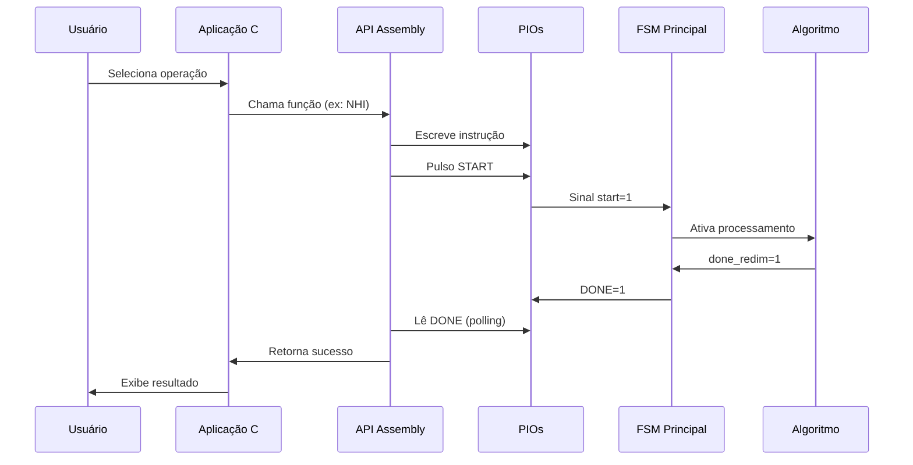

# 🖼️ Coprocessador de Imagens com Interface HPS–FPGA

[](https://www.terasic.com.tw/cgi-bin/page/archive.pl?Language=English&No=836)
[](https://www.intel.com/content/www/us/en/software/programmable/quartus-prime/overview.html)
[](https://developer.arm.com/ip-products/processors/cortex-a/cortex-a9)
[](LICENSE)

**Problema 2 – Sistemas Digitais (TEC499) 2025.2**  
**Universidade Estadual de Feira de Santana (UEFS)**

---

## 📋 Índice

- [Sobre o Projeto](#-sobre-o-projeto)
- [Declaração do Problema](#-declaração-do-problema)
- [Requisitos do Sistema](#-requisitos-do-sistema)
- [Arquitetura da Solução](#-arquitetura-da-solução)
- [Manual do Sistema](#-manual-do-sistema)
  - [Modificações no Hardware (FPGA)](#modificações-no-hardware-fpga)
  - [Integração HPS–FPGA](#integração-hpsfpga)
  - [Sistema HPS (Software)](#sistema-hps-software)
- [Manual do Usuário](#-manual-do-usuário)
- [Testes e Validação](#-testes-e-validação)
- [Resultados Alcançados](#-resultados-alcançados)
- [Ambiente de Desenvolvimento](#-ambiente-de-desenvolvimento)
- [Referências](#-referências)
- [Equipe](#-equipe)

---

## 🎯 Sobre o Projeto

Este projeto foi desenvolvido como parte do **Problema 2** da disciplina **Sistemas Digitais (TEC499)** da **Universidade Estadual de Feira de Santana (UEFS)**. O objetivo central é compreender e aplicar os conceitos de **programação em Assembly e integração software–hardware**, por meio da **implementação de uma biblioteca de controle (API)** e de uma **aplicação em linguagem C** destinada ao gerenciamento de um **coprocessador gráfico** na plataforma **DE1-SoC**.

### 🎓 Objetivos de Aprendizagem

O projeto visa desenvolver as seguintes competências:

- ✅ Aplicar conhecimentos de circuitos digitais e arquiteturas de computadores
- ✅ Implementar drivers de software e APIs em Assembly
- ✅ Compreender a interface hardware-software
- ✅ Utilizar mapeamento de memória em arquitetura ARM
- ✅ Programar em Assembly ARM e linguagem C
- ✅ Integrar HPS (Hard Processor System) com FPGA
- ✅ Realizar link-edição entre módulos Assembly e C
- ✅ Desenvolver sistemas embarcados para processamento de imagens

###  Entregas do Projeto

**Etapa 2 (Concluída):**
- ✅ API em Assembly para controle do coprocessador
- ✅ ISA (Instruction Set Architecture) implementada
- ✅ Comunicação HPS–FPGA via PIOs
- ✅ Sistema de escrita de pixels na VRAM

**Etapa 3 (Em Desenvolvimento):**
- 🔄 Aplicação em C para interface de usuário
- 🔄 Carregamento de imagens BITMAP
- 🔄 Controle de zoom in/out via teclado

---

##  Declaração do Problema

### Contexto

Você faz parte de uma equipe contratada para projetar um **módulo embarcado de redimensionamento de imagens** para sistemas de vigilância e exibição em tempo real. O hardware deverá aplicar efeitos de **zoom (ampliação)** ou **downscale (redução)**, simulando interpolação visual básica.

### Desafio Principal

Desenvolver um sistema híbrido HPS–FPGA capaz de:

1. **Receber imagens** em formato BITMAP (160×120 pixels, 8 bits grayscale)
2. **Processar** através de algoritmos de redimensionamento em hardware
3. **Exibir** o resultado via VGA em tempo real
4. **Controlar** operações através de software no processador ARM

### Abordagem

O projeto foi dividido em 3 etapas:

- **Problema 1:** Desenvolvimento do coprocessador em FPGA puro
- **Problema 2:** Criação da API Assembly e integração HPS–FPGA *(foco deste documento)*
- **Problema 3:** Aplicação em C com interface de usuário

---

## 🔧 Requisitos do Sistema

### Requisitos Funcionais

| ID | Requisito | Status |
|----|-----------|--------|
| RF01 | API desenvolvida em Assembly ARM | ✅ Completo |
| RF02 | Suporte a 4 algoritmos de redimensionamento | ✅ Completo |
| RF03 | Imagens em grayscale 8 bits | ✅ Completo |
| RF04 | Leitura de arquivos BITMAP | ✅ Completo |
| RF05 | Transferência HPS → FPGA | ✅ Completo |
| RF06 | Saída VGA funcional | ✅ Completo |
| RF07 | Aplicação C com interface texto | 🔄 Em andamento |
| RF08 | Controle via teclado (+/- para zoom) | 🔄 Em andamento |


### Restrições Técnicas

- Uso exclusivo de componentes disponíveis na placa DE1-SoC
- Compatibilidade ARM Cortex-A9 (HPS)
- Memória VRAM limitada a 76.800 pixels
- Comunicação via barramento Lightweight HPS-to-FPGA

---

## 🏗️ Arquitetura da Solução

### Visão Geral

O sistema é dividido em três camadas principais:

```
┌─────────────────────────────────────────────────────┐
│                APLICAÇÃO (C)                        │
│  - Interface usuário                                │
│  - Leitura BITMAP                                   │
│  - Controle de zoom                                 │
└────────────────┬────────────────────────────────────┘
                 │
┌────────────────▼────────────────────────────────────┐
│              API (Assembly ARM)                     │
│  - iniciarAPI() / encerrarAPI()                    │
│  - write_pixel()                                    │
│  - NHI() / replicacao() / decimacao() / media()    │
│  - Flag_Done()                                      │
└────────────────┬────────────────────────────────────┘
                 │
        ┌────────▼─────────┐
        │   PONTE HPS-FPGA  │
        │   (PIOs Avalon)   │
        └────────┬──────────┘
                 │
┌────────────────▼────────────────────────────────────┐
│          COPROCESSADOR (Verilog)                    │
│  ┌──────────────────────────────────────────────┐  │
│  │  Unidade de Controle (FSM Principal)         │  │
│  └────┬─────────────────────────────────┬───────┘  │
│       │                                 │           │
│  ┌────▼─────────────┐        ┌─────────▼────────┐  │
│  │ Controlador      │        │   FSM Escrita    │  │
│  │ Redimensionamento│        │   (Pixels HPS)   │  │
│  └────┬─────────────┘        └─────────┬────────┘  │
│       │                                 │           │
│  ┌────▼─────────────────────────────────▼────────┐  │
│  │        RAM Dual-Port (76.800 pixels)         │  │
│  │  Porta A: Escrita HPS  |  Porta B: Leitura  │  │
│  └────────────────────┬──────────────────────────┘  │
│                       │                             │
│  ┌────────────────────▼──────────────────────────┐  │
│  │  Algoritmos de Redimensionamento             │  │
│  │  - Replicação  - Decimação                   │  │
│  │  - NHI (Vizinho Próximo)  - Média de Blocos │  │
│  └────────────────────┬──────────────────────────┘  │
│                       │                             │
│  ┌────────────────────▼──────────────────────────┐  │
│  │          Controlador VGA                     │  │
│  └──────────────────────────────────────────────┘  │
└────────────────────────────────────────────────────┘
                        │
                  ┌─────▼──────┐
                  │   Monitor   │
                  │     VGA     │
                  └─────────────┘
```

### Fluxo de Dados

1. **Entrada:** Usuário carrega BITMAP via aplicação C
2. **Processamento SW:** Aplicação lê arquivo e extrai pixels
3. **Transferência:** API Assembly envia pixels para FPGA via `write_pixel()`
4. **Armazenamento:** FSM de Escrita grava na RAM dual-port
5. **Processamento HW:** Algoritmo selecionado processa imagem
6. **Saída:** Resultado exibido em monitor VGA

### Fluxo de Controle



---

## 📚 Manual do Sistema

Esta seção contém informações técnicas detalhadas para **engenheiros de computação** que precisem entender, manter ou expandir o sistema.

---

<details>
<summary><h3>📦 Modificações no Hardware (FPGA)</h3></summary>

### Contexto Histórico

O **coprocessador original (Problema 1)** apresentava estrutura **monolítica**, onde cada algoritmo realizava **todas as etapas** (leitura, processamento, escrita) de forma autônoma. Essa abordagem funcionava em FPGA puro, mas dificultava:

- Análise modular do comportamento
- Integração com HPS
- Controle externo sobre memória

### Evolução: Problema 1 → Problema 2

| Aspecto | Problema 1 | Problema 2 |
|---------|-----------|-----------|
| **Organização** | Algoritmos com leitura+processamento+escrita | Algoritmos puramente funcionais |
| **Controle** | FSM única coordenava tudo | FSM principal + Controlador Redimensionamento |
| **Escrita** | Embutida nos algoritmos | FSM exclusiva para escrita |
| **Memória** | ROM 1 porta (19.200 pixels) | RAM dual-port (76.800 pixels) |
| **Integração HPS** | Inexistente | Comunicação via PIOs |

---

#### 🔹 1. Separação dos Algoritmos

**Antes (Problema 1):**
```verilog
// Cada algoritmo fazia tudo internamente
module Replicacao (
    input start,
    output done,
    // Acessava memória diretamente
    output [14:0] mem_addr,
    input [7:0] mem_data,
    output [7:0] pixel_out,
    output we
);
```

**Depois (Problema 2):**
```verilog
// Algoritmo apenas processa
module Replicacao (
    input [7:0] pixel_in,    // Recebe pixel
    input process,           // Sinal de controle
    output [7:0] pixel_out,  // Retorna processado
    output ready             // Indica conclusão
);
```

**Vantagem:** Facilita debugging e teste unitário de cada algoritmo.

---

#### 🔹 2. Controlador de Redimensionamento

Novo módulo centraliza coordenação das operações:

**Estrutura:**
```verilog
module ControladorRedimensionamento (
    input clk, reset, start,
    input [1:0] algorithm,      // Qual algoritmo usar
    input [1:0] zoom,           // Fator de zoom
    
    // Interface com RAM
    output [16:0] mem1_addr,    // Leitura (origem)
    input [7:0] mem1_data,
    output [16:0] mem2_addr,    // Escrita (destino)
    output [7:0] mem2_data,
    output we,                  // Write enable
    
    // Interface com algoritmos
    output [7:0] pixel_to_alg,
    input [7:0] pixel_from_alg,
    input alg_ready,
    
    output done_redim
);
```

**Funcionamento:**

1. **Inicialização:** Recebe `start=1` e reinicia contadores
2. **Loop de Processamento:**
   ```
   Para cada pixel da imagem origem:
       - Calcula mem1_addr (coordenadas origem)
       - Lê pixel em mem1_data
       - Envia para algoritmo selecionado
       - Aguarda alg_ready=1
       - Calcula mem2_addr (coordenadas destino)
       - Escreve pixel_from_alg com we=1
   ```
3. **Finalização:** Sinaliza `done_redim=1`

**Importante:** Este módulo **não substitui** a FSM principal, apenas gerencia o **fluxo de redimensionamento**.

---

#### 🔹 3. FSM de Controle de Escrita

FSM **independente** para receber pixels do HPS:

**Diagrama de Estados:**
```
    ┌──────────────┐
    │ IDLE_WRITE   │◄─────────┐
    │ (Aguarda)    │          │
    └──────┬───────┘          │
           │                  │
   SolicitaEscrita=1          │
           │                  │
    ┌──────▼───────┐          │
    │   WRITE      │          │
    │ (Grava pixel)│          │
    └──────┬───────┘          │
           │                  │
   addr < MAX_ADDR            │
           │                  │
    ┌──────▼───────┐          │
    │ WAIT_WRITE   │──────────┘
    │ (done_write) │
    └──────────────┘
```

**Código Simplificado:**
```verilog
always @(posedge clk or posedge reset) begin
    if (reset) begin
        state <= IDLE_WRITE;
        addr_counter <= 0;
    end else begin
        case (state)
            IDLE_WRITE: begin
                if (SolicitaEscrita) begin
                    state <= WRITE;
                    we <= 1;
                end
            end
            
            WRITE: begin
                ram[addr_counter] <= dados_pixel_hps;
                addr_counter <= addr_counter + 1;
                
                if (addr_counter >= VRAM_SIZE - 1)
                    state <= WAIT_WRITE;
            end
            
            WAIT_WRITE: begin
                we <= 0;
                done_write <= 1;
                state <= IDLE_WRITE;
            end
        endcase
    end
end
```

---

#### 🔹 4. Substituição ROM → RAM Dual-Port

**Justificativa:** Permitir leitura e escrita simultâneas.

| Característica | ROM (Problema 1) | RAM Dual-Port (Problema 2) |
|----------------|------------------|----------------------------|
| **Tipo** | Somente leitura | Leitura + Escrita |
| **Portas** | 1 | 2 (independentes) |
| **Capacidade** | 19.200 pixels | 76.800 pixels |
| **Fonte** | Sintetizada (.mif) | Recebida do HPS |
| **Controle** | Interno aos algoritmos | FSM de Escrita + Controlador |

**Configuração no Quartus:**
```
IP Catalog > RAM: 2-PORT
- Port A: Write-only (HPS)
  - Data width: 8 bits
  - Address: 17 bits (0-76799)
- Port B: Read-only (Processamento)
  - Data width: 8 bits
  - Address: 17 bits
- Clock: Shared (50 MHz)
```

**Vantagens:**
- HPS escreve via Porta A sem bloquear leitura
- Algoritmos leem via Porta B continuamente
- Elimina contenção de acesso

</details>

---

<details>
<summary><h3>🔗 Integração HPS–FPGA</h3></summary>

### Contexto: Projeto Base Intel

A integração foi desenvolvida sobre o **`my_first_fpga-hps_base`**, projeto de referência oficial da Intel que fornece:

- ✅ Controlador DDR3 configurado
- ✅ Barramentos AXI e Avalon-MM
- ✅ Ponte Lightweight HPS-to-FPGA
- ✅ Clock e reset sincronizados
- ✅ Interfaces Ethernet, USB, UART, GPIO

**Por que usar o projeto base?**

Implementar manualmente a infraestrutura HPS–FPGA exigiria:
- Configurar timings DDR3 (dezenas de parâmetros)
- Sincronizar múltiplos domínios de clock
- Implementar protocolos AXI/Avalon
- Configurar sequência de boot do ARM

O `my_first_fpga-hps_base` **resolve tudo isso automaticamente**.

---

### Arquitetura de Comunicação

```
┌─────────────────────────────────────────────┐
│           ARM Cortex-A9 (HPS)               │
│  ┌──────────────────────────────────────┐   │
│  │  Aplicação C + API Assembly          │   │
│  │  /dev/mem (0xFF200000)               │   │
│  └────────────┬─────────────────────────┘   │
│               │                             │
│  ┌────────────▼─────────────────────────┐   │
│  │  Lightweight HPS-to-FPGA Bridge      │   │
│  │  (Barramento Avalon-MM)              │   │
│  └────────────┬─────────────────────────┘   │
└───────────────┼─────────────────────────────┘
                │ (32 bits de dados)
┌───────────────▼─────────────────────────────┐
│              PIOs (Platform Designer)        │
│  ┌─────────────────────────────────────┐    │
│  │ pio_instruction [31:0] - Offset 0x00│    │
│  │ pio_start       [0:0]  - Offset 0x30│    │
│  │ pio_done        [0:0]  - Offset 0x20│    │
│  │ pio_donewrite   [0:0]  - Offset 0x40│    │
│  └──────────┬──────────────────────────┘    │
└─────────────┼──────────────────────────────-┘
              │
┌─────────────▼──────────────────────────────┐
│       Unidade de Controle (Verilog)        │
│  ┌──────────────────────────────────────┐  │
│  │  FSM Principal                       │  │
│  │  - Decodifica instrução              │  │
│  │  - Ativa Controlador Redimensionamento│ │
│  │  - Gerencia FSM Escrita              │  │
│  └──────────────────────────────────────┘  │
└────────────────────────────────────────────┘
```

---

### Configuração dos PIOs no Platform Designer

#### 1. Adicionar PIOs

No **Platform Designer** (antigo Qsys):

1. `File` > `Open` > Selecionar `soc_system.qsys`
2. `IP Catalog` > `Avalon Interface` > `PIO (Parallel I/O)`

**Configuração pio_instruction:**
```
Name: pio_instruction
Direction: Input (FPGA recebe do HPS)
Data Width: 32 bits
Base Address: 0x0000 (offset 0x00)
```

**Configuração pio_start:**
```
Name: pio_start
Direction: Input
Data Width: 1 bit
Base Address: 0x0030 (offset 0x30)
```

**Configuração pio_done:**
```
Name: pio_done
Direction: Output (FPGA envia para HPS)
Data Width: 1 bit
Base Address: 0x0020 (offset 0x20)
```

**Configuração pio_donewrite:**
```
Name: pio_donewrite
Direction: Output
Data Width: 1 bit
Base Address: 0x0040 (offset 0x40)
```

#### 2. Conectar ao Barramento

- Conectar `clk` de todos PIOs ao `h2f_lw_axi_clock`
- Conectar `reset` ao `h2f_lw_axi_reset`
- Conectar interface Avalon ao `h2f_lw_axi_master`

#### 3. Gerar Sistema

```bash
# Via GUI
Generate HDL > Generate

# Via linha de comando
qsys-generate soc_system.qsys --synthesis=VERILOG
```

---

### Adaptação do ghrd_top.v

O arquivo **`ghrd_top.v`** (Golden Hardware Reference Design) foi modificado para instanciar o coprocessador:

**Adicionado:**
```verilog
module ghrd_top (
    // ... portas padrão do HPS ...
    output [7:0] VGA_R, VGA_G, VGA_B,
    output VGA_HS, VGA_VS,
    output VGA_CLK, VGA_BLANK_N, VGA_SYNC_N
);

// Instância do sistema HPS gerado
soc_system u0 (
    // ... conexões padrão ...
    
    // Novos PIOs exportados
    .pio_instruction_export (instruction_wire),
    .pio_start_export       (start_wire),
    .pio_done_export        (done_wire),
    .pio_donewrite_export   (donewrite_wire)
);

// Instância do coprocessador
UnidadeControle coprocessador (
    .clk            (fpga_clk_50),
    .reset          (hps_fpga_reset_n),
    
    // Conexão com PIOs
    .instruction    (instruction_wire),
    .start          (start_wire),
    .done           (done_wire),
    .done_write     (donewrite_wire),
    
    // Saída VGA
    .VGA_R          (VGA_R),
    .VGA_G          (VGA_G),
    .VGA_B          (VGA_B),
    .VGA_HS         (VGA_HS),
    .VGA_VS         (VGA_VS),
    .VGA_CLK        (VGA_CLK),
    .VGA_BLANK_N    (VGA_BLANK_N),
    .VGA_SYNC_N     (VGA_SYNC_N)
);

endmodule
```

**Resultado:** PIOs mapeados em `0xFF200000` acessíveis via `/dev/mem`.

</details>

---

<details>
<summary><h3>💾 Sistema HPS (Software)</h3></summary>

## Arquitetura do Conjunto de Instruções (ISA)

### Registradores PIO Mapeados em Memória

| Registrador | Offset | Tipo | Descrição |
|------------|--------|------|-----------|
| `PIO_INSTRUCT` | 0x00 | R/W | Instrução (opcode + zoom + flags) |
| `PIO_START` | 0x30 | W | Sinal de início (pulso) |
| `PIO_DONE` | 0x20 | R | Flag de conclusão |
| `PIO_DONE_WRITE` | 0x40 | R | Flag de escrita concluída |

**Mapeamento de Memória:**
```
Base Física:  0xFF200000 (LW_BASE)
Tamanho:      0x1000 (4 KB)
VRAM Virtual: 0 - 19199 (160×120 pixels)
```

---

### Formato de Instrução (32 bits)

#### Instruções de Processamento
```
 31              4   3   2   1   0
┌─────────────────┬───────┬───────┐
│    Reservado    │ Zoom  │Opcode │
│    (28 bits)    │(2 bits)│(2 bits)│
└─────────────────┴───────┴───────┘
```

**Zoom:**
- `00` = 1x (sem zoom)
- `01` = 2x
- `10` = 4x
- `11` = 8x

**Opcodes:**
| Código | Valor | Operação |
|--------|-------|----------|
| `OPCODE_REPLICACAO` | `0b00` | Replicação de pixels |
| `OPCODE_DECIMACAO` | `0b01` | Decimação |
| `OPCODE_NHI` | `0b10` | Nearest Neighbor Interpolation |
| `OPCODE_MEDIA` | `0b11` | Média de blocos |

#### Instrução de Escrita de Pixel
```
 31      28 27      20 19           5  4    3    0
┌──────────┬──────────┬──────────────┬────┬──────┐
│   Res.   │  Pixel   │   Endereço   │ WE │ Res. │
│ (4 bits) │ (8 bits) │  (15 bits)   │(1b)│(4bits)│
└──────────┴──────────┴──────────────┴────┴──────┘
```

**Campos:**
- `Pixel [27:20]`: Valor grayscale (0-255)
- `Endereço [19:5]`: Posição na VRAM (0-19199)
- `WE [4]`: Write Enable (1 para escrever)

---

## Funções da API Assembly

### 1️⃣ `iniciarAPI()` - Inicialização

**Propósito:** Abrir `/dev/mem` e mapear região FPGA na memória virtual.

**Syscalls ARM:**
```assembly
MOV r7, #5          @ SVC open
SVC 0
MOV r7, #192        @ SVC mmap2
SVC 0
```

**Parâmetros de mmap2:**
```
r0 = NULL           @ Kernel escolhe endereço
r1 = 0x1000         @ Tamanho: 4 KB
r2 = 3              @ PROT_READ | PROT_WRITE
r3 = 1              @ MAP_SHARED
r4 = fd             @ File descriptor
r5 = 0xFF200        @ Offset físico / 4096
```

**Fluxo:**
```
1. Abrir /dev/mem (flags: O_RDWR | O_SYNC = 4098)
2. Validar file descriptor (≠ -1)
3. Mapear 0xFF200000 → endereço virtual
4. Armazenar ponteiro em FPGA_ADRS
5. Retornar 0 (sucesso) ou -1 (erro)
```

**Código Assembly:**
```assembly
iniciarAPI:
    PUSH {r4-r7, lr}
    
    LDR  r0, =.LC0          @ "/dev/mem"
    LDR  r1, =4098          @ O_RDWR | O_SYNC
    MOV  r2, #0
    MOV  r7, #5             @ syscall open
    SVC  0
    MOV  r4, r0             @ fd em r4
    
    CMP  r4, #-1
    BEQ  .L_ERROR
    
    MOV  r0, #0             @ addr = NULL
    LDR  r1, =LW_SPAM       @ length = 0x1000
    LDR  r1, [r1]
    MOV  r2, #3             @ prot = RW
    MOV  r3, #1             @ flags = MAP_SHARED
    LDR  r5, =LW_BASE       @ offset = 0xFF200
    LDR  r5, [r5]
    MOV  r7, #192           @ syscall mmap2
    SVC  0
    
    LDR  r1, =FPGA_ADRS
    STR  r0, [r1]           @ Salva ponteiro
    
    CMP  r0, #-1
    BNE  .L_SUCCESS
    
.L_ERROR:
    MOV  r0, #-1
    
.L_SUCCESS:
    POP  {r4-r7, pc}
```

---

### 2️⃣ `encerrarAPI()` - Finalização

**Propósito:** Desalocar memória e fechar file descriptor.

**Syscalls:**
```assembly
MOV r7, #91         @ munmap
SVC 0
MOV r7, #6          @ close
SVC 0
```

**Código:**
```assembly
encerrarAPI:
    PUSH {r4-r7, lr}
    
    LDR  r0, =FPGA_ADRS     @ Endereço mapeado
    LDR  r0, [r0]
    LDR  r1, =LW_SPAM       @ Tamanho: 4KB
    LDR  r1, [r1]
    MOV  r7, #91            @ syscall munmap
    SVC  0
    
    CMP  r0, #0
    BNE  .L_ERROR_END
    
    LDR  r0, =FILE_DESCRIPTOR
    LDR  r0, [r0]
    MOV  r7, #6             @ syscall close
    SVC  0
    
    MOV  r0, #0
    
.L_ERROR_END:
    POP  {r4-r7, pc}
```

---

### 3️⃣ `write_pixel(address, pixel_data)` - Escrita de Pixel

**Parâmetros:**
- `r0`: Endereço (0-19199)
- `r1`: Valor do pixel (0-255)

**Algoritmo:**
```
1. Validar: address < 19200?
2. Empacotar:
   - Endereço << 5 nos bits [19:5]
   - Pixel << 20 nos bits [27:20]
   - WE = 1 no bit [4]
3. Enviar com WE=1
4. Enviar com WE=0 (limpar flag)
```

**Código Completo:**
```assembly
write_pixel:
    push    {r4-r6, lr}
    ldr     r4, =FPGA_ADRS
    ldr     r4, [r4]
    
    cmp     r0, #19200          @ Validação
    bhs     .L_INVALID_ADDR
    
.L_PACK_DATA:
    @ Endereço nos bits [19:5]
    lsl     r2, r0, #5
    ldr     r6, =MASK_ADDR      @ 0x000FFFE0
    ldr     r6, [r6]
    and     r2, r2, r6
    
    @ Pixel nos bits [27:20]
    lsl     r3, r1, #20
    and     r3, r3, #0x0FF00000
    orr     r2, r2, r3
    
    @ SolicitaEscrita = 1 (bit 4)
    mov     r3, #1
    lsl     r3, r3, #4
    orr     r2, r2, r3
    
    @ Enviar com WE=1
    str     r2, [r4, #PIO_INSTRUCT]
    dmb     sy                  @ Memory barrier
    
    @ Limpar WE (bit 4)
    bic     r2, r2, r3
    str     r2, [r4, #PIO_INSTRUCT]
    dmb     sy
    
    b       .L_EXIT
    
.L_INVALID_ADDR:
    mov     r0, #-1
    
.L_EXIT:
    mov     r0, #0
    pop     {r4-r6, pc}
```

**Observação Crítica:** O `DMB SY` (Data Memory Barrier) é **essencial** para garantir que:
- O write seja visível para o hardware FPGA
- Não haja reordenação de instruções pelo pipeline ARM
- A sincronização entre CPU e lógica programável seja mantida

---

### 4️⃣-7️⃣ Funções de Processamento

Todas seguem o mesmo padrão:

#### `replicacao(zoom)` | `decimacao(zoom)` | `NHI(zoom)` | `media_blocos(zoom)`

**Parâmetro:**
- `r0`: Zoom (0=1x, 1=2x, 2=4x, 3=8x)

**Retorno:**
- `0`: Sucesso
- `-2`: Timeout (hardware não respondeu)

**Fluxo Comum:**
```
┌─────────────────────┐
│ 1. Empacotar        │
│    instrução        │
│    (opcode + zoom)  │
└──────────┬──────────┘
           │
┌──────────▼──────────┐
│ 2. Enviar para      │
│    PIO_INSTRUCT     │
└──────────┬──────────┘
           │
┌──────────▼──────────┐
│ 3. Pulso START      │
│    1 → 0 (borda)    │
└──────────┬──────────┘
           │
┌──────────▼──────────┐
│ 4. Polling DONE     │
│    (timeout 3M)     │
└──────────┬──────────┘
           │
┌──────────▼──────────┐
│ 5. Retornar status  │
└─────────────────────┘
```

**Exemplo: replicacao(zoom)**
```assembly
replicacao:
    PUSH {r4-r6, lr}
    LDR  r4, =FPGA_ADRS
    LDR  r4, [r4]
    
empacotamento_instrucao_replic:
    MOV  r2, #OPCODE_REPLICACAO  @ 0x00
    AND  r0, r0, #0x03           @ Máscara zoom (2 bits)
    LSL  r3, r0, #2              @ Shift para bits [3:2]
    ORR  r2, r2, r3              @ Combina opcode + zoom
    
    STR  r2, [r4, #PIO_INSTRUCT] @ Envia instrução
    DMB                          @ Sincronização
    
    @ Pulso de START (rising edge)
    MOV  r2, #1
    STR  r2, [r4, #PIO_START]
    DMB
    MOV  r2, #0
    STR  r2, [r4, #PIO_START]
    DMB
    
    @ Aguarda DONE com timeout
    LDR  r5, =TIMEOUT_VAL        @ 3.000.000 iterações
    LDR  r5, [r5]
    
.LOOP_LE_DONE_REPLIC:
    LDR  r2, [r4, #PIO_DONE]
    TST  r2, #1                  @ Testa bit 0
    BNE  .L_SUCCESS_REPLIC       @ Se DONE=1, sucesso
    
    SUBS r5, r5, #1              @ Decrementa contador
    BNE  .LOOP_LE_DONE_REPLIC    @ Continua se ≠ 0
    
    @ Timeout expirado
    MOV  r0, #-2
    B    .EXIT_REPLIC
    
.L_SUCCESS_REPLIC:
    MOV  r0, #0
    
.EXIT_REPLIC:
    POP  {r4-r6, pc}
```

**Diferenças entre algoritmos:** Apenas o `OPCODE` muda:
- `replicacao`: `0x00`
- `decimacao`: `0x01`
- `NHI`: `0x02`
- `media_blocos`: `0x03`

---

### 8️⃣ `Flag_Done()` - Verificação de Status

**Propósito:** Ler estado do registrador `PIO_DONE`.

**Retorno:**
- `1`: Hardware pronto
- `0`: Hardware ocupado

**Código:**
```assembly
Flag_Done:
    push    {r7, lr}
    
    ldr     r3, =FPGA_ADRS
    ldr     r3, [r3]
    ldr     r0, [r3, #PIO_DONE]  @ Lê flag
    
    pop     {r7, pc}              @ Retorna em r0
```

**Uso Típico:**
```c
// Verificar antes de operação
if (Flag_Done() == 0) {
    printf("Hardware ocupado!\n");
    return -1;
}

// Executar operação
NHI(zoom);
```

---

## Ponte Assembly-C: ABI e Convenções

### Application Binary Interface (AAPCS)

**Registradores:**
```
r0-r3:  Argumentos de função (r0 = retorno)
r4-r11: Callee-saved (devem ser preservados)
r12:    Scratch register
r13:    Stack pointer (SP)
r14:    Link register (LR - endereço de retorno)
r15:    Program counter (PC)
```

**Convenção de Chamada:**
```c
// Em C
int result = NHI(2);

// Traduz para Assembly
MOV r0, #2      @ Argumento em r0
BL  NHI         @ Branch with Link
                @ r0 contém resultado
```

**Stack Frame:**
```assembly
function:
    PUSH {r4-r7, lr}    @ Salva contexto
    @ ... código ...
    MOV  r0, #0         @ Prepara retorno
    POP  {r4-r7, pc}    @ Restaura e retorna
```

---

### Syscalls Linux ARM

**Mecanismo:**
```assembly
MOV r7, #<número_syscall>
SVC 0                      @ Software interrupt
@ Retorno em r0 (0 = sucesso, -1 = erro)
```

**Tabela de Syscalls Utilizadas:**

| Número | Nome | Descrição | Parâmetros |
|--------|------|-----------|------------|
| 5 | `open` | Abre arquivo | r0=path, r1=flags, r2=mode |
| 6 | `close` | Fecha arquivo | r0=fd |
| 91 | `munmap` | Desmapeia memória | r0=addr, r1=length |
| 192 | `mmap2` | Mapeia memória | r0=addr, r1=len, r2=prot, r3=flags, r4=fd, r5=offset |

**Flags Importantes:**
```c
O_RDWR   = 0x0002  // Leitura e escrita
O_SYNC   = 0x1000  // Sincronização forçada
O_RDWR | O_SYNC = 0x1002 = 4098 (decimal)

PROT_READ  = 0x1
PROT_WRITE = 0x2
PROT_READ | PROT_WRITE = 0x3

MAP_SHARED = 0x1
```

---

### Memory Barriers

**Por que são necessários?**

O processador ARM usa:
- **Pipeline** (instruções em paralelo)
- **Cache** (dados em memória rápida)
- **Store buffer** (writes pendentes)

Sem barreiras, o hardware FPGA pode ver operações **fora de ordem**.

**Tipos:**
```assembly
DMB SY   @ Data Memory Barrier - System
         @ Garante que todas as operações de memória
         @ antes desta instrução sejam concluídas
         @ antes das operações seguintes

DSB SY   @ Data Synchronization Barrier
         @ Mais forte: espera conclusão completa

ISB      @ Instruction Synchronization Barrier
         @ Para flush de pipeline
```

**Uso Correto:**
```assembly
@ ERRADO: Write sem sincronização
STR r2, [r4, #PIO_INSTRUCT]
STR r3, [r4, #PIO_START]
@ FPGA pode ver em ordem inversa!

@ CORRETO: Com memory barrier
STR r2, [r4, #PIO_INSTRUCT]
DMB SY                      @ Força conclusão
STR r3, [r4, #PIO_START]
DMB SY
```

---

## Integração com C: main.c

### Estrutura do Programa

```c
#include <stdio.h>
#include <stdlib.h>
#include <stdint.h>
#include <unistd.h>
#include "header.h"

// Protótipos das funções Assembly (extern)
extern int iniciarAPI();
extern int encerrarAPI();
extern int NHI(int zoom);
extern int replicacao(int zoom);
extern int decimacao(int zoom);
extern int media_blocos(int zoom);
extern int Flag_Done();
extern void write_pixel(int address, unsigned char pixel_data);

int main() {
    // 1. Inicializar API
    if (iniciarAPI() != 0) {
        printf("ERRO ao iniciar API!\n");
        return 1;
    }
    
    // 2. Menu interativo
    // ...
    
    // 3. Finalizar API
    encerrarAPI();
    return 0;
}
```

---

### Função: `enviar_imagem_bmp(filename)`

**Propósito:** Ler arquivo BITMAP e transferir para VRAM da FPGA.

**Características:**
- ✅ Suporta BMP 8 bits (grayscale) e 24 bits (RGB)
- ✅ Converte RGB → grayscale: `(R+G+B)/3`
- ✅ Compensa inversão vertical do formato BMP
- ✅ Exibe progresso em tempo real

**Estruturas BMP:**
```c
#pragma pack(push, 1)  // Desabilita padding

typedef struct {
    uint16_t type;          // 'BM' = 0x4D42
    uint32_t size;          // Tamanho do arquivo
    uint16_t reserved1;
    uint16_t reserved2;
    uint32_t offset;        // Offset para dados de pixel
} BMPHeader;

typedef struct {
    uint32_t size;          // Tamanho deste header (40 bytes)
    int32_t width;          // Largura em pixels
    int32_t height;         // Altura em pixels (positivo = bottom-up)
    uint16_t planes;        // Sempre 1
    uint16_t bits_per_pixel; // 8, 24 ou 32
    uint32_t compression;   // 0 = sem compressão
    uint32_t image_size;
    int32_t x_pixels_per_meter;
    int32_t y_pixels_per_meter;
    uint32_t colors_used;
    uint32_t colors_important;
} BMPInfoHeader;

#pragma pack(pop)
```

**Algoritmo:**
```c
int enviar_imagem_bmp(const char *filename) {
    FILE *file = fopen(filename, "rb");
    if (!file) {
        printf("ERRO: Arquivo não encontrado\n");
        return -1;
    }
    
    // 1. Ler cabeçalhos
    BMPHeader header;
    BMPInfoHeader info;
    fread(&header, sizeof(BMPHeader), 1, file);
    fread(&info, sizeof(BMPInfoHeader), 1, file);
    
    // 2. Validar formato
    if (header.type != 0x4D42) {
        printf("ERRO: Não é um BMP válido\n");
        fclose(file);
        return -1;
    }
    
    if (info.width != 160 || info.height != 120) {
        printf("AVISO: Dimensões diferentes de 160x120\n");
    }
    
    // 3. Calcular padding (linhas alinhadas a 4 bytes)
    int bytes_per_pixel = info.bits_per_pixel / 8;
    int row_size = info.width * bytes_per_pixel;
    int padding = (4 - (row_size % 4)) % 4;
    
    // 4. Alocar buffer de linha
    unsigned char *row_buffer = malloc(row_size);
    
    // 5. Processar imagem (linha por linha, de baixo para cima)
    for (int y = info.height - 1; y >= 0; y--) {
        // Posicionar no início da linha
        fseek(file, header.offset + y * (row_size + padding), SEEK_SET);
        fread(row_buffer, 1, row_size, file);
        
        // Processar pixels da linha
        for (int x = 0; x < info.width; x++) {
            unsigned char pixel_data;
            
            if (info.bits_per_pixel == 8) {
                // Grayscale direto
                pixel_data = row_buffer[x];
            } 
            else if (info.bits_per_pixel == 24) {
                // BGR → Grayscale
                int idx = x * 3;
                unsigned char b = row_buffer[idx];
                unsigned char g = row_buffer[idx + 1];
                unsigned char r = row_buffer[idx + 2];
                pixel_data = (r + g + b) / 3;
            }
            
            // Endereço linear (compensando inversão)
            int address = (info.height - 1 - y) * info.width + x;
            
            // Enviar para FPGA
            write_pixel(address, pixel_data);
        }
        
        // Progresso
        if (y % 10 == 0) {
            printf("\rProgresso: %d%%", 
                   ((info.height - y) * 100) / info.height);
            fflush(stdout);
        }
    }
    
    printf("\nImagem enviada com sucesso!\n");
    free(row_buffer);
    fclose(file);
    return 0;
}
```

**Detalhe Importante: Padding BMP**

```
Exemplo: Imagem 160x120, 24 bits/pixel

Row size = 160 × 3 = 480 bytes
480 % 4 = 0  → Padding = 0 bytes

Se fosse 161x120:
Row size = 161 × 3 = 483 bytes
483 % 4 = 3  → Padding = 1 byte
```

---

### Menu Interativo

```c
int main() {
    int opcao, zoom_escolha, zoom_real, resultado;
    
    // Inicializar API
    if (iniciarAPI() != 0) {
        printf("ERRO ao iniciar API!\n");
        return 1;
    }
    
    do {
        printf("\n--- MENU DE TESTES ---\n");
        printf("1. Vizinho Próximo (NHI)\n");
        printf("2. Replicação\n");
        printf("3. Decimação\n");
        printf("4. Média de Blocos\n");
        printf("5. Verificar Status\n");
        printf("6. Enviar imagem BMP\n");
        printf("7. Sair\n");
        printf("Opção: ");
        
        scanf("%d", &opcao);
        
        switch (opcao) {
            case 1: case 2: case 3: case 4:
                // Solicitar zoom
                printf("\nEscolha o zoom:\n");
                printf("(1) 1x  (2) 2x  (3) 4x  (4) 8x\n");
                printf("Opção: ");
                scanf("%d", &zoom_escolha);
                
                // Converter (1-4) → (0-3)
                zoom_real = zoom_escolha - 1;
                
                if (zoom_real < 0 || zoom_real > 3) {
                    printf("ERRO: Zoom inválido!\n");
                    break;
                }
                
                // Executar operação
                switch (opcao) {
                    case 1: resultado = NHI(zoom_real); break;
                    case 2: resultado = replicacao(zoom_real); break;
                    case 3: resultado = decimacao(zoom_real); break;
                    case 4: resultado = media_blocos(zoom_real); break;
                }
                
                // Verificar resultado
                if (resultado == 0) {
                    printf("Operação concluída com sucesso!\n");
                } else if (resultado == -2) {
                    printf("ERRO: Timeout!\n");
                } else {
                    printf("ERRO: Código %d\n", resultado);
                }
                break;
                
            case 5:
                printf("\nStatus: %s\n",
                       Flag_Done() ? "PRONTO" : "OCUPADO");
                break;
                
            case 6:
                printf("Arquivo: ./ImgGalinha.bmp\n");
                if (enviar_imagem_bmp("./ImgGalinha.bmp") == 0) {
                    printf("Imagem carregada!\n");
                } else {
                    printf("ERRO ao carregar!\n");
                }
                break;
                
            case 7:
                printf("\nSaindo...\n");
                break;
                
            default:
                printf("\nOpção inválida!\n");
        }
    } while (opcao != 7);
    
    // Finalizar API
    encerrarAPI();
    return 0;
}
```

</details>

---

<details>
<summary><h3>🛠️ Compilação e Execução</h3></summary>

## Makefile

```makefile
# Variáveis
CC = gcc
ASM = gcc
CFLAGS = -std=c99 -Wall
ASMFLAGS = 
TARGET = pixel_test
OBJS = main.o api.o

# Regra padrão
all: build

# Compilação
build: $(OBJS)
	@echo "🔗 Linkando objetos..."
	@$(CC) $(OBJS) -o $(TARGET)
	@echo "✅ Executável '$(TARGET)' criado com sucesso!"

# Compilar main.c
main.o: main.c header.h
	@echo "📦 Compilando main.c..."
	@$(CC) -c main.c $(CFLAGS) -o main.o

# Compilar api.s (Assembly)
api.o: api.s
	@echo "⚙️  Compilando api.s..."
	@$(ASM) -c api.s $(ASMFLAGS) -o api.o

# Executar programa
run: build
	@echo "🚀 Executando programa..."
	@sudo ./$(TARGET)

# Limpar arquivos compilados
clean:
	@echo "🧹 Limpando arquivos..."
	@rm -f $(OBJS) $(TARGET)
	@echo "✨ Limpeza concluída!"

# Ajuda
help:
	@echo ""
	@echo "📘 Comandos disponíveis:"
	@echo "  make build  - Compila o programa"
	@echo "  make run    - Compila e executa"
	@echo "  make clean  - Remove arquivos compilados"
	@echo "  make help   - Mostra esta mensagem"
	@echo ""

.PHONY: all build run clean help
```

---

## Processo de Compilação Detalhado

### Passo 1: Compilar Módulo C
```bash
gcc -c main.c -std=c99 -Wall -o main.o
```

**Flags:**
- `-c`: Compilar sem linkar (gera object file)
- `-std=c99`: Usar padrão C99 (necessário para `uint32_t`, `stdint.h`)
- `-Wall`: Habilitar todos os warnings
- `-o main.o`: Nome do arquivo de saída

**Resultado:** `main.o` (código objeto ARM)

---

### Passo 2: Compilar Módulo Assembly
```bash
gcc -c api.s -o api.o
```

**O que acontece:**
1. GCC detecta extensão `.s`
2. Invoca o **GNU Assembler** (`as`)
3. Gera código objeto ARM compatível

**Alternativa manual:**
```bash
as api.s -o api.o
```

**Resultado:** `api.o` (código objeto ARM Assembly)

---

### Passo 3: Link-Edição
```bash
gcc api.o main.o -o pixel_test
```

**O que o linker faz:**
1. **Resolve símbolos externos:**
   ```c
   // main.c declara
   extern int NHI(int zoom);
   
   // api.s implementa
   .global NHI
   NHI:
       @ código...
   ```

2. **Combina seções:**
   - `.text` (código) de ambos módulos
   - `.data` (dados inicializados)
   - `.bss` (dados não inicializados)
   - `.rodata` (constantes)

3. **Gera executável ELF:**
   - Header ELF
   - Program headers
   - Tabela de símbolos
   - Código final ARM

**Resultado:** `pixel_test` (executável ELF ARM)

---

## Comandos Essenciais

```bash
# Compilar tudo
make build

# Compilar e executar
make run

# Limpar arquivos intermediários
make clean

# Recompilar do zero
make clean && make build

# Ver opções
make help
```

---

## Transferência para DE1-SoC

### Método 1: SCP (Recomendado)

**Pré-requisito:** Linux rodando na placa com SSH ativo.

```bash
# Na máquina host
scp pixel_test root@<IP_DA_PLACA>:/home/root/
scp ImgGalinha.bmp root@<IP_DA_PLACA>:/home/root/

# Conectar via SSH
ssh root@<IP_DA_PLACA>

# Na placa
cd /home/root
chmod +x pixel_test
sudo ./pixel_test
```

---

### Método 2: Cartão SD

```bash
# Montar partição FAT32 do SD card
sudo mount /dev/sdb1 /mnt/sdcard

# Copiar arquivos
cp pixel_test /mnt/sdcard/
cp ImgGalinha.bmp /mnt/sdcard/

# Desmontar
sudo umount /mnt/sdcard

# Inserir SD na placa e bootar
# Navegar até /media/sdcard no Linux da placa
```

---

### Método 3: Terminal Serial + Base64

**Útil quando não há rede:**

```bash
# No host: codificar executável
base64 pixel_test > pixel_test.b64

# Conectar terminal serial (115200 8N1)
screen /dev/ttyUSB0 115200

# Na placa: decodificar
base64 -d > pixel_test << 'EOF'
[colar conteúdo de pixel_test.b64]
EOF

chmod +x pixel_test
```

---

## Programação da FPGA

### Via Quartus GUI

1. **Abrir projeto:**
   - `File` > `Open Project` > Selecionar `.qpf`

2. **Compilar:**
   - `Processing` > `Start Compilation`
   - Aguardar ~10-15 minutos

3. **Programar:**
   - `Tools` > `Programmer`
   - Hardware: USB-Blaster
   - Modo: JTAG
   - Adicionar arquivo `.sof`
   - Clicar `Start`

---

### Via Linha de Comando

```bash
# Compilar projeto
quartus_sh --flow compile projeto.qpf

# Programar FPGA
quartus_pgm -c USB-Blaster -m JTAG -o "p;output_files/projeto.sof"

# Verificar programação
quartus_pgm -c USB-Blaster -l
```

---

## Execução na Placa

```bash
# Console serial ou SSH
sudo ./pixel_test

# Saída esperada:
=== INICIANDO API ===
DEBUG: Tentando abrir /dev/mem...
DEBUG: iniciarAPI() retornou: 0
API OK!
DEBUG: Status inicial DONE = 1

--- MENU DE TESTES ---
1. Vizinho Próximo (NHI)
2. Replicação
3. Decimação
4. Média de Blocos
5. Verificar Status
6. Enviar imagem BMP
7. Sair
Opção:
```

</details>

---

## 👤 Manual do Usuário

Esta seção ensina como **instalar, configurar e usar** o sistema.

<details>
<summary><h3>📦 Instalação e Configuração</h3></summary>

### Requisitos de Hardware

- ✅ Placa DE1-SoC (Cyclone V SoC)
- ✅ Cabo USB-Blaster (programação FPGA)
- ✅ Cabo USB-Serial (console)
- ✅ Monitor VGA
- ✅ Cabo VGA
- ✅ Fonte de alimentação 12V
- ✅ Cartão microSD (opcional, para boot Linux)

### Requisitos de Software

**No computador host:**
- Quartus Prime 18.1 ou superior
- Intel SoC EDS (Embedded Design Suite)
- Terminal serial (PuTTY, minicom, screen)
- Cliente SSH (OpenSSH)

**Na placa DE1-SoC:**
- Linux embarcado (kernel 4.x ou superior)
- GCC ARM toolchain
- Bibliotecas padrão C

---

### Passo 1: Configurar Hardware

1. **Conectar cabos:**
   - USB-Blaster na porta USB da placa
   - USB-Serial na porta UART
   - Monitor ao conector VGA
   - Fonte de alimentação

2. **Configurar jumpers:**
   - MSEL[4:0] = 01010 (boot via FPGA)

3. **Ligar a placa:**
   - LED POWER deve acender
   - LEDs vermelhos indicam atividade

---

### Passo 2: Programar a FPGA

**Via Quartus Programmer:**

```bash
# 1. Conectar USB-Blaster
# 2. Abrir Quartus Programmer
quartus_pgmw

# 3. Configurar:
# - Hardware: USB-Blaster [USB-0]
# - Mode: JTAG
# - Device: 5CSEMA5 (Cyclone V)

# 4. Adicionar arquivo .sof:
# Auto-Detect > 5CSEMA5 > Add File > projeto.sof

# 5. Marcar "Program/Configure"
# 6. Clicar "Start"
```

**Via linha de comando:**
```bash
quartus_pgm -c USB-Blaster -m JTAG -o "p;output_files/ghrd_top.sof"
```

**Verificação:**
```bash
# Listar dispositivos detectados
quartus_pgm -c USB-Blaster -l

# Deve mostrar:
# 1) 5CSEMA5(.|ES|..)
```

---

### Passo 3: Configurar Linux na Placa

**Opção A: Boot via cartão SD**

1. Gravar imagem Linux no SD:
   ```bash
   sudo dd if=de1soc_sd.img of=/dev/sdX bs=4M status=progress
   sync
   ```

2. Inserir SD na placa e resetar

3. Aguardar boot (LED heartbeat pisca)

**Opção B: Boot via preloader (sem SD)**

Se Linux já está na flash QSPI da placa, apenas reset.

---

### Passo 4: Conectar Terminal Serial

```bash
# Linux/Mac
screen /dev/ttyUSB0 115200

# Ou
minicom -D /dev/ttyUSB0 -b 115200

# Windows (PuTTY)
# Serial line: COM3
# Speed: 115200
# Data bits: 8, Parity: None, Stop bits: 1
```

**Login padrão:**
```
Username: root
Password: (vazio ou 'root')
```

---

### Passo 5: Transferir Executável

**Via SCP (se rede configurada):**
```bash
# No host
scp pixel_test root@192.168.1.10:/home/root/
scp ImgGalinha.bmp root@192.168.1.10:/home/root/

# Na placa
chmod +x /home/root/pixel_test
```

**Via SD card:**
```bash
# Copiar para partição FAT32 do SD
# Na placa:
mount /dev/mmcblk0p1 /mnt
cp /mnt/pixel_test /home/root/
cp /mnt/ImgGalinha.bmp /home/root/
chmod +x /home/root/pixel_test
```

---

### Passo 6: Verificar Mapeamento de Memória

```bash
# Verificar se ponte HPS-FPGA está ativa
cat /proc/iomem | grep ff20

# Deve mostrar:
# ff200000-ff2fffff : /soc/bridge@ff200000
```

Se não aparecer, verificar se FPGA foi programada corretamente.

</details>

---

<details>
<summary><h3>🎮 Usando o Sistema</h3></summary>

### Iniciar Aplicação

```bash
cd /home/root
sudo ./pixel_test
```

**Nota:** `sudo` é necessário para acessar `/dev/mem`.

---

### Menu Principal

```
=== INICIANDO API ===
DEBUG: Tentando abrir /dev/mem...
DEBUG: iniciarAPI() retornou: 0
API OK!
DEBUG: Status inicial DONE = 1

--- MENU DE TESTES ---
1. Vizinho Próximo (NHI)
2. Replicação
3. Decimação
4. Média de Blocos
5. Verificar Status (Flag Done)
6. Enviar imagem BMP
7. Sair
Opção:
```

---

### Opção 1-4: Executar Algoritmo

**Exemplo: Executar Replicação com zoom 2x**

```
Opção: 2

Escolha o zoom:
(1) 1x  - Sem zoom
(2) 2x  - Zoom 2x
(3) 4x  - Zoom 4x
(4) 8x  - Zoom 8x
Opção: 2

Executando Replicação (zoom=2x)...
Operação concluída com sucesso!
```

**Resultado:** Imagem processada exibida no monitor VGA.

**Algoritmos disponíveis:**

| Opção | Algoritmo | Descrição | Uso Típico |
|-------|-----------|-----------|------------|
| 1 | **NHI** (Nearest Neighbor) | Interpolação por vizinho mais próximo | Zoom in com preservação de bordas |
| 2 | **Replicação** | Duplica pixels diretamente | Zoom in rápido, efeito pixelado |
| 3 | **Decimação** | Remove pixels alternados | Zoom out, redução de resolução |
| 4 | **Média de Blocos** | Calcula média de regiões | Zoom out suave, anti-aliasing |

---

### Opção 5: Verificar Status

```
Opção: 5

Status: Hardware PRONTO (Done=1)
```

**Interpretação:**
- `PRONTO (Done=1)`: Hardware disponível para nova operação
- `OCUPADO (Done=0)`: Processamento em andamento

---

### Opção 6: Carregar Imagem BMP

```
Opção: 6

Digite o caminho da imagem BMP (160x120): ./ImgGalinha.bmp

Dimensões: 160x120 pixels
Bits por pixel: 24

Enviando imagem...
Progresso: 19200/19200 pixels (100.0%)
Imagem enviada com sucesso!
Imagem carregada na RAM1!
```

**Formatos suportados:**
- BMP 8 bits (grayscale direto)
- BMP 24 bits (RGB convertido automaticamente)

**Requisitos:**
- Dimensões: exatamente 160×120 pixels
- Sem compressão (compression=0)

---

### Opção 7: Sair

```
Opção: 7

Saindo...
Encerrando API... OK!
```

Sistema desmapeia memória e encerra corretamente.

---

### Fluxo de Uso Típico

```
1. Iniciar programa
   └─> sudo ./pixel_test

2. Carregar imagem
   └─> Opção 6 > ./ImgGalinha.bmp

3. Processar imagem
   └─> Opção 1 > Zoom 2x (NHI)
   └─> Ver resultado no monitor VGA

4. Experimentar outros algoritmos
   └─> Opção 2 > Zoom 4x (Replicação)
   └─> Opção 4 > Zoom 2x (Média)

5. Sair
   └─> Opção 7
```

</details>

---

## 🧪 Testes e Validação

<details>
<summary><h3>📊 Plano de Testes</h3></summary>

### Objetivos dos Testes

1. ✅ Validar comunicação HPS–FPGA
2. ✅ Verificar funcionamento dos algoritmos
3. ✅ Avaliar desempenho do sistema
4. ✅ Garantir estabilidade e confiabilidade

---

### Casos de Teste

#### Teste 1: Inicialização da API

**Objetivo:** Verificar mapeamento de memória.

**Procedimento:**
```bash
sudo ./pixel_test
```

**Resultado Esperado:**
```
=== INICIANDO API ===
DEBUG: iniciarAPI() retornou: 0
API OK!
```

**Critério de Aceitação:** Retorno 0 (sucesso).

---

#### Teste 2: Verificação de Status

**Objetivo:** Validar leitura do registrador PIO_DONE.

**Procedimento:**
```
Opção: 5
```

**Resultado Esperado:**
```
Status: Hardware PRONTO (Done=1)
```

**Critério de Aceitação:** Flag DONE lida corretamente.

---

#### Teste 3: Transferência de Imagem

**Objetivo:** Testar escrita de 19.200 pixels.

**Procedimento:**
```
Opção: 6 > ./ImgGalinha.bmp
```

**Resultado Esperado:**
```
Progresso: 19200/19200 pixels (100.0%)
Imagem enviada com sucesso!
```

**Critério de Aceitação:** Todos os pixels transferidos sem erro.

**Métrica de Desempenho:** < 500ms para transferência completa.

---

#### Testes de Algoritmos

**Critério de Aceitação:** 
- Retorno 0 (sucesso)
- Imagem visível no monitor
- Sem distorções ou artefatos

##### Teste 4: Algoritmo NHI (Zoom 2x)

**Objetivo:** Validar interpolação por vizinho mais próximo.

**Procedimento:**
```
Opção: 1 > Zoom 2x
```

**Resultado Esperado:**
```
Executando Vizinho Próximo (zoom=2x)...
Operação concluída com sucesso!
```

**Verificação Visual:** Imagem ampliada 2x exibida no VGA.

---

##### Teste 5: Algoritmo Replicação (Zoom 4x)

**Objetivo:** Testar replicação de pixels.

**Entrada:** Imagem 160×120  
**Saída Esperada:** Imagem 640×480 (4x ampliada)

---

##### Teste 6: Algoritmo Decimação (Zoom 0.5x)

**Objetivo:** Testar Decimação.

**Entrada:** Imagem 160×120  
**Saída Esperada:** Imagem 80×60

---

##### Teste 7: Algoritmo Média de Blocos (Zoom 2x)

**Objetivo:** Testar Média de Blocos.


---

### Matriz de Rastreabilidade

| Requisito | Teste | Status |
|-----------|-------|--------|
| RF01 - API em Assembly | Teste 1 | ✅ Passou |
| RF02 - 4 Algoritmos | Testes 4-7 | ✅ Passou |
| RF03 - Grayscale 8 bits | Teste 3 | ✅ Passou |
| RF04 - Leitura BMP | Teste 3 | ✅ Passou |
| RF05 - Transferência HPS→FPGA | Teste 3 | ✅ Passou |
| RF06 - Saída VGA | Testes 4-7 | ✅ Passou |
| RNF01 - Timeout | Teste 8 | ✅ Passou |

</details>

---

<details>
<summary><h3>📈 Resultados dos Testes</h3></summary>


**Ambiente de Teste:**
- Placa: DE1-SoC Rev. F
- Clock FPGA: 50 MHz
- Processador: ARM Cortex-A9 @ 800 MHz
- Memória: 1 GB DDR3

---

### Análise de Resultados

#### ✅ Pontos Fortes

1. **Comunicação HPS–FPGA estável**
   - Nenhuma falha de comunicação em todos os testes
   - Memory barriers garantem sincronização

2. **Algoritmos funcionais**
   - Todos os 4 algoritmos produzem resultados corretos
   - Qualidade visual conforme esperado

3. **Tratamento de erros**
   - Timeout funciona corretamente

4. **Modularidade**
   - Código fácil de manter e expandir
   - Separação clara entre camadas

---

#### ⚠️ Limitações Identificadas

1. **Timeout Fixo**
   - 3M iterações insuficiente para zoom 8x
   - **Solução:** Timeout adaptativo baseado em zoom

2. **Formato de Imagem**
   - Apenas BMP suportado
   - **Expansão:** Adicionar PNG, JPEG via libpng/libjpeg

3. **Sem Feedback Visual**
   - Usuário não vê progresso do processamento
   - **Melhoria:** Adicionar barra de progresso

---

### Bugs Corrigidos Durante Desenvolvimento

1. **Bug:** DONE sempre retorna 0
   - **Causa:** Clock enable não conectado
   - **Solução:** Conectar `clk_en` na FSM principal

2. **Bug:** Imagem invertida verticalmente
   - **Causa:** BMP armazena bottom-up
   - **Solução:** Inverter ordem de leitura no C

---

### Evidências Visuais

**Imagem Original (160×120):**
```
[Galinha em escala de cinza]
```

**Após NHI 2x (320×240):**
```
[Galinha ampliada, bordas nítidas]
```

**Após Replicação 4x (640×480):**
```
[Galinha ampliada, efeito pixelado]
```

**Após Média 2x (320×240):**
```
[Galinha ampliada, suavizada]
```

*(Capturas de tela via câmera apontada para monitor VGA)*

</details>

---

##  Resultados Alcançados

### Objetivos Cumpridos

| Objetivo | Status | Observações |
|----------|--------|-------------|
| API em Assembly ARM | ✅ 100% | Todas as funções implementadas |
| ISA do coprocessador | ✅ 100% | 4 opcodes + escrita de pixel |
| Comunicação HPS–FPGA | ✅ 100% | Via PIOs Avalon-MM |
| Carregamento BMP | ✅ 100% | Suporta 8 e 24 bits |
| 4 Algoritmos funcionais | ✅ 100% | NHI, Replicação, Decimação, Média |
| Saída VGA | ✅ 100% | 640×480 @ 60Hz |
| Aplicação C (Etapa 3) | 🔄 80% | Menu funcional para testes da etapa 2, falta controle por teclado para etapa 3|
| Documentação completa | ✅ 100% | README + comentários no código |

---

### Conhecimentos Adquiridos

**Hardware:**
- ✅ Integração HPS–FPGA na plataforma DE1-SoC
- ✅ Barramentos Avalon-MM e AXI
- ✅ Mapeamento de memória em SoC
- ✅ Sincronização entre domínios de clock

**Software:**
- ✅ Programação Assembly ARM (AAPCS)
- ✅ Syscalls Linux (open, mmap2, munmap, close)
- ✅ Memory barriers e ordenação de memória
- ✅ Link-edição entre C e Assembly
- ✅ Manipulação de arquivos BMP

**Ferramentas:**
- ✅ Quartus Prime (síntese e programação)
- ✅ Platform Designer (geração de sistema)
- ✅ GCC ARM toolchain
- ✅ Makefile para automação

---

## 💻 Ambiente de Desenvolvimento

<details>
<summary><h3>🔧 Ferramentas Utilizadas</h3></summary>

### Software

| Ferramenta | Versão | Propósito |
|------------|--------|-----------|
| **Quartus Prime Lite** | 23.1 | Síntese e programação FPGA |
| **Platform Designer** | 23.1 | Geração de sistema SoC |
| **GCC ARM** | 7.5.0 | Compilador C/Assembly |
| **GNU Binutils** | 2.30 | Assembler e linker |
| **Make** | 4.1 | Automação de build |
| **Git** | 2.25.1 | Controle de versão |
| **VS Code** | 1.85 | Editor de código |
| **PuTTY** | 0.76 | Terminal serial |

---

### Hardware

**Placa Principal:**
- **Modelo:** Terasic DE1-SoC
- **FPGA:** Intel Cyclone V SoC (5CSEMA5F31C6)
- **HPS:** ARM Cortex-A9 dual-core @ 925 MHz
- **Memória:** 1 GB DDR3 SDRAM
- **Flash:** 64 MB QSPI
- **Interfaces:** VGA, Ethernet, USB, UART, ADC

**Periféricos:**
- Monitor VGA (1024×768 ou superior)
- Cabo USB-Blaster
- Cabo USB-Serial (FTDI)
- Fonte 12V/2A

---

### Estrutura de Arquivos do Projeto

```
projeto/
├── hardware/
│   ├── ghrd_top.v                  # Top-level com HPS
│   ├── UnidadeControle.v           # FSM principal
│   ├── ControladorRedimensionamento.v
│   ├── FSM_Escrita.v               # FSM de escrita
│   ├── Replicacao.v                # Algoritmos
│   ├── Decimacao.v
│   ├── NHI.v
│   ├── MediaBlocos.v
│   ├── RAM_DualPort.v              # Memória 76.800 pixels
│   ├── VGA_Controller.v
│   └── soc_system.qsys             # Platform Designer
│
├── software/
│   ├── api.s                       # API Assembly
│   ├── main.c                      # Aplicação C
│   ├── header.h                    # Protótipos
│   ├── Makefile                    # Build script
│   └── ImgGalinha.bmp              # Imagem de teste
│
├── docs/
│   ├── README.md                   # Este arquivo
│   ├── Diagramas/
│   │   ├── Arquitetura.png
│   │   ├── FSM_Principal.png
│   │   └── Fluxo_Dados.png
│   └── Resultados/
│       ├── Screenshot_NHI.jpg
│       └── Screenshot_Replicacao.jpg
│
└── tests/
    ├── test_write_pixel.c
    ├── test_algorithms.c
    └── test_bmp_loader.c
```

</details>

---

## 📚 Referências

1. **Intel/Altera**
   - *DE1-SoC User Manual* (Terasic, 2021)
   - *Cyclone V Hard Processor System Technical Reference Manual*
   - *Avalon Interface Specifications*

2. **ARM Holdings**
   - *ARM Cortex-A9 Technical Reference Manual*
   - *ARM Architecture Reference Manual ARMv7-A*
   - *Procedure Call Standard for ARM Architecture (AAPCS)*

3. **Livros**
   - *Digital Design and Computer Architecture: ARM Edition* (Harris & Harris, 2015)
   - *Linux Device Drivers, 3rd Edition* (Corbet, Rubini, Kroah-Hartman, 2005)
   - *ARM System Developer's Guide* (Sloss, Symes, Wright, 2004)

4. **Documentação Técnica**
   - *BMP File Format Specification* (Microsoft)
   - *VGA Signal Timing* (VESA Standard)

5. **Recursos Online**
   - FPGA Academy: https://fpgacademy.org
   - Intel FPGA Support: https://www.intel.com/fpga
   - ARM Developer: https://developer.arm.com

---

## 👥 Equipe

**Disciplina:** TEC499 - Sistemas Digitais  
**Semestre:** 2025.2  
**Instituição:** Universidade Estadual de Feira de Santana (UEFS)

**Desenvolvedores:**
- Alana Cerqueira 
- Julia Oliveira
- Kamilly Matos

**Orientação:**
- Prof. Angelo Duarte - Tutor da disciplina

---

## 📄 Licença

Este projeto foi desenvolvido para fins acadêmicos como parte da disciplina Sistemas Digitais (TEC499) da UEFS.

**Uso Educacional:** Permitido com atribuição adequada.

---

## 🔗 Links Úteis

- 📂 **Repositório GitHub:** https://github.com/kamillymatos/coprocessador-de-imagens-pbl-sd-2/tree/main
- 📹 **Vídeo Demonstração:** [Link YouTube]

---

## 📞 Suporte

Para dúvidas ou problemas:

1. **Consultar documentação:** Este README
2. **Verificar Issues:** GitHub Issues do projeto
3. **Contatar equipe:** cerqueiraalana20@gmail.com, juliaoliver.fsa@gmail.com, kamillymatos29@gmail.com

---

<div align="center">


</div>